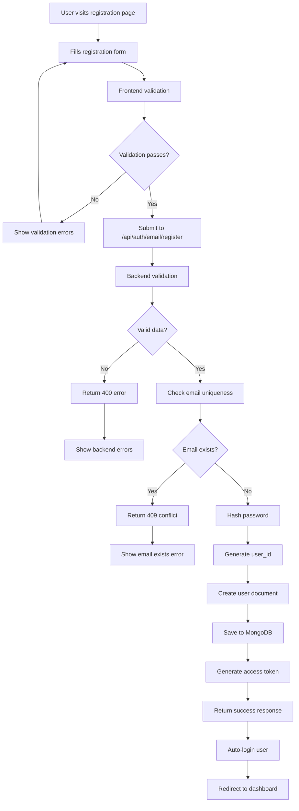

# User Authentication & Registration Workflow

## Overview

This document outlines the complete user authentication system for BistroBoard, including the implementation plan for the missing user registration functionality. The system supports both email/password authentication and Google OAuth for restaurants, vendors, and administrators.

## Current System Analysis

### Existing Components

#### Backend Authentication
- **Primary Auth Module**: [`auth_simple.py`](backend/app/auth_simple.py) - Simple JWT-like token system
- **Google OAuth Module**: [`google_oauth.py`](backend/app/google_oauth.py) - Google authentication integration
- **Auth Router**: [`routers/auth.py`](backend/app/routers/auth.py) - API endpoints for authentication
- **User Model**: [`mongo_models.py`](backend/app/mongo_models.py) - MongoDB user document schema

#### Frontend Components
- **Login Form**: [`EmailLoginForm.js`](frontend/src/components/EmailLoginForm.js) - Email/password login interface
- **Registration Form**: [`EmailRegistrationForm.js`](frontend/src/components/EmailRegistrationForm.js) - User registration interface
- **API Client**: [`api.js`](frontend/src/lib/api.js) - HTTP client with authentication methods

### Critical Gap Identified

**Missing Backend Registration Endpoint**: The frontend registration form calls `/api/auth/email/register` but this endpoint does not exist in the backend router.

## User Registration Workflow Design

### 1. Registration Process Flow



### 2. Required API Endpoints

#### POST /api/auth/email/register

**Purpose**: Create a new user account with email and password

**Request Format**:
```json
{
  "full_name": "John Doe",
  "email": "john@example.com",
  "password": "securepassword123",
  "role": "restaurant"
}
```

**Request Validation**:
- `full_name`: Required, 2-100 characters, trimmed
- `email`: Required, valid email format, case-insensitive, unique
- `password`: Required, minimum 6 characters
- `role`: Required, must be "restaurant" or "vendor"

**Success Response (201 Created)**:
```json
{
  "access_token": "eyJhbGciOiJIUzI1NiIsInR5cCI6IkpXVCJ9...",
  "token_type": "bearer",
  "user_id": 12345,
  "role": "restaurant",
  "name": "John Doe",
  "email": "john@example.com"
}
```

**Error Responses**:
- `400 Bad Request`: Invalid input data
- `409 Conflict`: Email already exists
- `500 Internal Server Error`: Database or server error

#### POST /api/auth/email/login

**Purpose**: Authenticate user with email and password

**Request Format**:
```json
{
  "email": "john@example.com",
  "password": "securepassword123"
}
```

**Success Response (200 OK)**:
```json
{
  "access_token": "eyJhbGciOiJIUzI1NiIsInR5cCI6IkpXVCJ9...",
  "token_type": "bearer",
  "user_id": 12345,
  "role": "restaurant",
  "name": "John Doe",
  "email": "john@example.com"
}
```

### 3. Database Schema Requirements

#### User Document Structure

The existing [`User`](backend/app/mongo_models.py) model supports the registration workflow but requires these considerations:

**Required Fields for Registration**:
```python
class User(Document):
    user_id: Indexed(int, unique=True)  # Auto-generated sequential ID
    username: Indexed(str, unique=True)  # Generated from email
    password_hash: Optional[str] = None  # Hashed password
    role: Indexed(str)  # "restaurant", "vendor", "admin"
    name: str  # Full name from registration
    email: str  # Primary email address
    phone: str = ""  # Optional, can be empty initially
    address: str = ""  # Optional, can be empty initially
    description: Optional[str] = None  # Optional profile description
    
    # Authentication provider tracking
    auth_provider: str = "local"  # "local", "google", or "both"
    
    # Account status
    is_active: bool = True
    status: str = "active"  # "active", "inactive", "pending_approval"
    
    # Timestamps
    created_at: datetime = Field(default_factory=datetime.utcnow)
    updated_at: datetime = Field(default_factory=datetime.utcnow)
```

**User ID Generation Strategy**:
- Query for the highest existing `user_id`
- Increment by 1 for new users
- Handle race conditions with proper error handling

**Username Generation**:
- Use email address as username for consistency
- Ensure uniqueness (should match email uniqueness)

### 4. Frontend Component Modifications

#### EmailRegistrationForm.js Updates

**Current Implementation Status**: ✅ **Already Complete**

The existing registration form is well-implemented with:
- Comprehensive form validation
- Account type selection (restaurant/vendor)
- Password confirmation
- Error handling
- Loading states
- Proper API integration

**No modifications required** - the form correctly calls `authAPI.register()` with the expected payload format.

#### EmailLoginForm.js Updates

**Current Implementation Status**: ⚠️ **Needs Minor Update**

The login form currently calls `authAPI.emailLogin()` but the backend endpoint is `/auth/login` (not `/auth/email/login`). 

**Required Change**:
- Update API call to use the correct endpoint or create the `/auth/email/login` endpoint

### 5. Backend Implementation Requirements

#### New Registration Endpoint

**File**: `backend/app/routers/auth.py`

**Required Implementation**:

```python
from pydantic import BaseModel, EmailStr, validator

class UserRegistration(BaseModel):
    full_name: str
    email: EmailStr
    password: str
    role: str
    
    @validator('full_name')
    def validate_full_name(cls, v):
        if not v or len(v.strip()) < 2:
            raise ValueError('Full name must be at least 2 characters')
        if len(v.strip()) > 100:
            raise ValueError('Full name must be less than 100 characters')
        return v.strip()
    
    @validator('password')
    def validate_password(cls, v):
        if len(v) < 6:
            raise ValueError('Password must be at least 6 characters')
        return v
    
    @validator('role')
    def validate_role(cls, v):
        if v not in ['restaurant', 'vendor']:
            raise ValueError('Role must be either restaurant or vendor')
        return v

@router.post("/email/register", response_model=Token)
async def register_user(
    user_data: UserRegistration,
    request: Request
):
    # Check if email already exists
    existing_user = await User.find_one(User.email == user_data.email.lower())
    if existing_user:
        raise HTTPException(
            status_code=status.HTTP_409_CONFLICT,
            detail="Email address already registered"
        )
    
    # Generate new user ID
    last_user = await User.find().sort(-User.user_id).limit(1).to_list()
    new_user_id = (last_user[0].user_id + 1) if last_user else 1
    
    # Create new user
    new_user = User(
        user_id=new_user_id,
        username=user_data.email.lower(),
        password_hash=get_password_hash(user_data.password),
        role=user_data.role,
        name=user_data.full_name,
        email=user_data.email.lower(),
        phone="",
        address="",
        auth_provider="local",
        is_active=True,
        status="active"
    )
    
    await new_user.save()
    
    # Log registration event
    await log_user_event(
        user_id=new_user.user_id,
        event_type="registration",
        details={
            "registration_method": "email",
            "role": user_data.role,
            "user_agent": request.headers.get("user-agent")
        },
        request=request
    )
    
    # Generate access token
    access_token_expires = timedelta(minutes=ACCESS_TOKEN_EXPIRE_MINUTES)
    access_token = create_access_token(
        data={
            "sub": new_user.username,
            "user_id": new_user.user_id,
            "role": new_user.role,
            "name": new_user.name,
            "is_impersonating": False
        },
        expires_delta=access_token_expires
    )
    
    return {
        "access_token": access_token,
        "token_type": "bearer",
        "user_id": new_user.user_id,
        "role": new_user.role,
        "name": new_user.name,
        "email": new_user.email
    }
```

#### Email Login Endpoint (Optional)

**File**: `backend/app/routers/auth.py`

Create a dedicated email login endpoint to match frontend expectations:

```python
@router.post("/email/login", response_model=Token)
async def email_login(
    user_credentials: UserLogin,
    request: Request
):
    # Find user by email
    user = await User.find_one(User.email == user_credentials.username.lower())
    
    # Verify user and password
    if not user or not verify_password(user_credentials.password, user.password_hash):
        raise HTTPException(
            status_code=status.HTTP_401_UNAUTHORIZED,
            detail="Incorrect email or password",
            headers={"WWW-Authenticate": "Bearer"},
        )
    
    # Rest of login logic (same as existing login endpoint)
    # ...
```

### 6. Security Considerations

#### Password Security
- **Current**: Uses SHA256 hashing (basic)
- **Recommendation**: Consider upgrading to bcrypt for production
- **Minimum Requirements**: 6 characters (consider increasing to 8+)

#### Input Validation
- **Email**: Validate format and normalize to lowercase
- **Full Name**: Trim whitespace, validate length (2-100 chars)
- **Role**: Restrict to allowed values only
- **Rate Limiting**: Consider implementing registration rate limiting

#### Data Privacy
- **Email Uniqueness**: Case-insensitive comparison
- **Password Storage**: Never store plain text passwords
- **User Data**: Minimal required fields for registration

### 7. Error Handling

#### Frontend Error Display
- **Validation Errors**: Show field-specific errors
- **Network Errors**: Show user-friendly messages
- **Server Errors**: Provide actionable feedback

#### Backend Error Responses
- **400 Bad Request**: Detailed validation errors
- **409 Conflict**: Clear conflict resolution guidance
- **500 Server Error**: Generic error message (log details server-side)

### 8. Testing Strategy

#### Unit Tests Required
- Registration endpoint validation
- Password hashing/verification
- User ID generation
- Email uniqueness checking

#### Integration Tests Required
- Complete registration flow
- Login after registration
- Error scenarios (duplicate email, invalid data)
- Token generation and validation

#### Frontend Tests Required
- Form validation
- API integration
- Error handling
- Success flow

### 9. Deployment Considerations

#### Environment Variables
- Ensure `SECRET_KEY` is properly configured
- Database connection settings
- CORS settings for frontend integration

#### Database Indexes
- Verify indexes on `user_id`, `username`, `email`, and `role`
- Monitor query performance

#### Monitoring
- Track registration success/failure rates
- Monitor authentication errors
- Log security events

## Implementation Priority

1. **High Priority**: Create `/api/auth/email/register` endpoint
2. **Medium Priority**: Create `/api/auth/email/login` endpoint (or update frontend)
3. **Low Priority**: Security enhancements (bcrypt, rate limiting)

## Conclusion

The BistroBoard authentication system is well-architected with comprehensive frontend components and a solid foundation. The primary gap is the missing registration endpoint in the backend. Once implemented, the system will provide a complete user registration and authentication workflow supporting both email/password and Google OAuth methods.