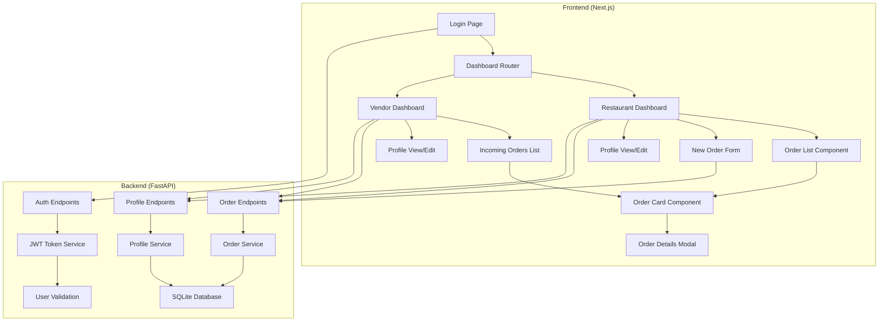
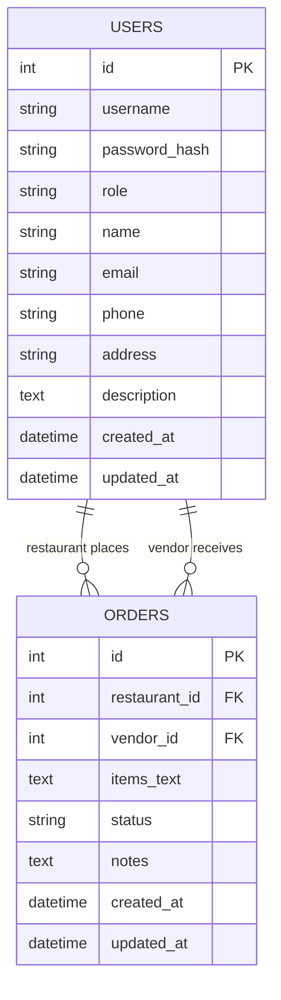

# 🏗️ BistroBoard MVP - Detailed Implementation Plan

## 📋 Project Overview
**Goal**: Create a minimal viable product for restaurant-supplier order management with core features:
1. Free-form order placement & tracking (Restaurant side)
2. Vendor order management (Vendor side)
3. Basic business profiles for restaurants and vendors

**Scope**: Local development only, pre-seeded users, focus on core functionality

## 🏛️ Architecture Overview



## 🗄️ Database Schema



## 🛠️ Implementation Plan

### Phase 1: Project Setup & Backend Foundation (2-3 hours)
1. **Project Structure Setup**
   ```
   bistroboard/
   ├── backend/
   │   ├── app/
   │   │   ├── __init__.py
   │   │   ├── main.py
   │   │   ├── models.py
   │   │   ├── database.py
   │   │   ├── auth.py
   │   │   └── routers/
   │   │       ├── __init__.py
   │   │       ├── auth.py
   │   │       ├── orders.py
   │   │       └── profiles.py
   │   ├── requirements.txt
   │   └── seed_data.py
   └── frontend/
       ├── package.json
       ├── next.config.js
       ├── src/
       │   ├── app/
       │   │   ├── layout.js
       │   │   ├── page.js
       │   │   ├── dashboard/
       │   │   └── profile/
       │   ├── components/
       │   │   ├── AuthForm.js
       │   │   ├── Dashboard.js
       │   │   ├── OrderList.js
       │   │   ├── OrderCard.js
       │   │   ├── OrderDetails.js
       │   │   ├── NewOrderForm.js
       │   │   ├── ProfileView.js
       │   │   └── ProfileEdit.js
       │   └── lib/
       │       └── api.js
       └── public/
   ```

2. **Backend Core Setup**
   - FastAPI application with CORS middleware
   - SQLite database with SQLAlchemy ORM
   - Enhanced User and Order models with profile fields
   - JWT authentication setup
   - Database seeding script

3. **Pre-seeded Test Data**
   - Restaurant: "Mario's Pizzeria" - `username: "restaurant1", password: "demo123"`
     - Phone: "(555) 123-4567"
     - Address: "123 Main St, Downtown, CA 90210"
     - Description: "Family-owned Italian restaurant serving authentic pizzas and pasta since 1985"
   - Vendor: "Fresh Valley Produce" - `username: "vendor1", password: "demo123"`
     - Phone: "(555) 987-6543"
     - Address: "456 Farm Road, Valley, CA 90211"
     - Description: "Premium organic produce supplier serving restaurants across the region"

### Phase 2: Backend API Development (4-5 hours)
1. **Authentication Endpoints**
   - `POST /token` - Login endpoint returning JWT with user profile
   - JWT middleware for protected routes

2. **Order Management Endpoints**
   - `POST /api/orders` - Create new order (restaurant only)
   - `GET /api/orders` - Get orders (filtered by user role)
   - `GET /api/orders/{order_id}` - Get order details
   - `PUT /api/orders/{order_id}/status` - Update order status (vendor only)
   - `PUT /api/orders/{order_id}/notes` - Add notes to order

3. **Profile Management Endpoints**
   - `GET /api/profile` - Get current user's profile
   - `PUT /api/profile` - Update current user's profile
   - `GET /api/vendors` - Get list of vendors (for restaurant order form)
   - `GET /api/restaurants` - Get list of restaurants (for vendor reference)

4. **API Response Formats**
   ```json
   // Order object
   {
     "id": 1,
     "restaurant": {
       "id": 1,
       "name": "Mario's Pizzeria",
       "phone": "(555) 123-4567",
       "address": "123 Main St, Downtown, CA 90210"
     },
     "vendor": {
       "id": 2,
       "name": "Fresh Valley Produce",
       "phone": "(555) 987-6543",
       "address": "456 Farm Road, Valley, CA 90211"
     },
     "items_text": "10 lbs Tomatoes\n5 heads Lettuce\n2 lbs Onions",
     "status": "pending",
     "notes": "",
     "created_at": "2025-06-16T13:00:00Z",
     "updated_at": "2025-06-16T13:00:00Z"
   }
   
   // Profile object
   {
     "id": 1,
     "name": "Mario's Pizzeria",
     "email": "mario@mariospizza.com",
     "phone": "(555) 123-4567",
     "address": "123 Main St, Downtown, CA 90210",
     "description": "Family-owned Italian restaurant...",
     "role": "restaurant"
   }
   ```

### Phase 3: Frontend Foundation (2-3 hours)
1. **Next.js Setup**
   - App router configuration
   - Tailwind CSS for styling
   - API client utilities

2. **Authentication Flow**
   - Login form component
   - JWT token storage (localStorage)
   - Protected route wrapper
   - User context provider

3. **Dashboard Router**
   - Role-based dashboard rendering
   - Navigation between views
   - Profile access in header

### Phase 4: Restaurant Features (4-5 hours)
1. **Restaurant Dashboard**
   - Order list display with enhanced details
   - Status indicators with color coding
   - "New Order" and "View Profile" buttons
   - Quick stats (total orders, pending, etc.)

2. **New Order Form**
   - Vendor selection dropdown with contact info
   - Free-form text area for items
   - Order notes field
   - Form validation and submission
   - Vendor profile preview

3. **Order Tracking & Details**
   - Detailed order view modal
   - Real-time status updates
   - Order history with vendor contact info
   - Print/export order functionality

4. **Profile Management**
   - View current restaurant profile
   - Edit profile form
   - Profile validation

### Phase 5: Vendor Features (3-4 hours)
1. **Vendor Dashboard**
   - Incoming orders list with restaurant details
   - Order filtering by status
   - Quick actions for status updates
   - Restaurant contact information display

2. **Order Management**
   - Detailed order view with restaurant info
   - Status update buttons (Pending → Confirmed → Fulfilled)
   - Add notes to orders
   - Contact restaurant directly (phone/email links)

3. **Profile Management**
   - View current vendor profile
   - Edit profile form
   - Business description and contact updates

### Phase 6: Enhanced Features (2-3 hours)
1. **Contact Integration**
   - Click-to-call phone numbers
   - Mailto links for emails
   - Address links to maps

2. **Business Directory**
   - Restaurant can browse vendor profiles
   - Vendor can view restaurant profiles
   - Search and filter functionality

3. **Order Communication**
   - Notes system for order clarifications
   - Status change notifications
   - Order history with communication log

### Phase 7: Polish & Testing (2-3 hours)
1. **UI/UX Improvements**
   - Responsive design
   - Loading states
   - Error handling
   - Profile photo placeholders

2. **Testing & Bug Fixes**
   - Manual testing of all workflows
   - Profile CRUD operations
   - Cross-browser compatibility
   - Error edge cases

## 🎨 UI/UX Design Approach

### Color Scheme & Branding
- Primary: Blue (#3B82F6) - Trust and reliability
- Secondary: Green (#10B981) - Success and growth
- Warning: Orange (#F59E0B) - Pending status
- Error: Red (#EF4444) - Issues
- Gray: (#6B7280) - Secondary text and borders

### Status Color Coding
- **Pending**: Orange badge with clock icon
- **Confirmed**: Blue badge with check icon
- **Fulfilled**: Green badge with truck icon

### Key UI Components
1. **Dashboard Cards**: Clean, card-based layout with profile info
2. **Status Badges**: Clear visual indicators with icons
3. **Contact Cards**: Business profile cards with contact actions
4. **Action Buttons**: Prominent CTAs with proper spacing
5. **Form Design**: Simple, focused forms with validation
6. **Profile Headers**: Business name, contact info, and description

### Profile Display Elements
- Business name as primary heading
- Contact info (phone, email) as clickable links
- Address with map link
- Business description in card format
- Role badge (Restaurant/Vendor)

## 🔧 Technical Specifications

### Backend Dependencies
```
fastapi==0.104.1
uvicorn==0.24.0
sqlalchemy==2.0.23
python-jose[cryptography]==3.3.0
python-multipart==0.0.6
bcrypt==4.1.2
pydantic==2.5.0
```

### Frontend Dependencies
```
next==14.0.3
react==18.2.0
tailwindcss==3.3.6
axios==1.6.2
@heroicons/react==2.0.18
```

### Development Commands
```bash
# Backend
cd backend && uvicorn app.main:app --reload --port 8000

# Frontend  
cd frontend && npm run dev

# Database seeding
cd backend && python seed_data.py
```

## 🚀 Success Metrics

### Functional Requirements
1. **Order Management**
   - Restaurant can create and view orders
   - Vendor can view and update order status
   - Status changes reflect in real-time

2. **Profile Management**
   - Users can view and edit their profiles
   - Contact information is accessible during orders
   - Business descriptions provide context

3. **Communication**
   - Contact info is clickable (phone/email)
   - Order notes facilitate communication
   - Business profiles enhance trust

### Technical Requirements
- Clean, maintainable code structure
- Proper error handling and validation
- Responsive design across devices
- Fast, responsive interactions

### User Experience
- Intuitive navigation with profile access
- Clear business information display
- Professional contact management
- Enhanced order context with profiles

## ⏱️ Time Estimation
- **Total**: 19-26 hours
- **Day 1 (10-12 hours)**: Phases 1-4 (Setup + Backend + Restaurant features)
- **Day 2 (9-14 hours)**: Phases 5-7 (Vendor features + Enhancements + Polish)

## 🔄 Future Enhancements (Post-MVP)
- Profile photos upload
- Business hours management
- Delivery preferences
- Payment terms and methods
- Order templates for frequent items
- Notification system
- Mobile app version

This enhanced plan maintains the weekend MVP scope while adding valuable business context through profiles, making the platform more professional and user-friendly for real-world restaurant-supplier relationships.