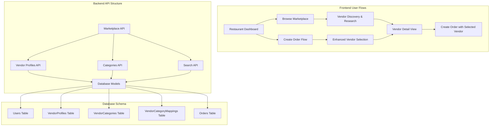
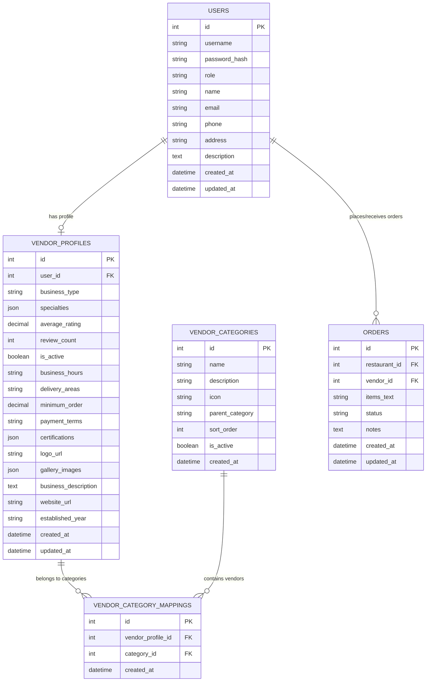

# BistroBoard Vendor Marketplace Implementation Plan

## Overview
This document outlines the complete implementation plan for adding a comprehensive Vendor Marketplace feature to the BistroBoard MVP. The marketplace will provide both a dedicated browsing experience and enhanced vendor selection within the order creation flow.

## Architecture Overview



## Database Schema Design

### Enhanced Entity Relationship Diagram



### Database Tables Specification

#### 1. vendor_profiles
```sql
CREATE TABLE vendor_profiles (
    id INTEGER PRIMARY KEY AUTOINCREMENT,
    user_id INTEGER NOT NULL REFERENCES users(id),
    business_type VARCHAR(100),
    specialties JSON,
    average_rating DECIMAL(3,2) DEFAULT 0.0,
    review_count INTEGER DEFAULT 0,
    is_active BOOLEAN DEFAULT TRUE,
    business_hours TEXT,
    delivery_areas TEXT,
    minimum_order DECIMAL(10,2),
    payment_terms TEXT,
    certifications JSON,
    logo_url VARCHAR(255),
    gallery_images JSON,
    business_description TEXT,
    website_url VARCHAR(255),
    established_year VARCHAR(4),
    created_at DATETIME DEFAULT CURRENT_TIMESTAMP,
    updated_at DATETIME DEFAULT CURRENT_TIMESTAMP
);
```

#### 2. vendor_categories
```sql
CREATE TABLE vendor_categories (
    id INTEGER PRIMARY KEY AUTOINCREMENT,
    name VARCHAR(100) NOT NULL,
    description TEXT,
    icon VARCHAR(50),
    parent_category VARCHAR(100),
    sort_order INTEGER DEFAULT 0,
    is_active BOOLEAN DEFAULT TRUE,
    created_at DATETIME DEFAULT CURRENT_TIMESTAMP
);
```

#### 3. vendor_category_mappings
```sql
CREATE TABLE vendor_category_mappings (
    id INTEGER PRIMARY KEY AUTOINCREMENT,
    vendor_profile_id INTEGER NOT NULL REFERENCES vendor_profiles(id),
    category_id INTEGER NOT NULL REFERENCES vendor_categories(id),
    created_at DATETIME DEFAULT CURRENT_TIMESTAMP,
    UNIQUE(vendor_profile_id, category_id)
);
```

## Category Structure

### Food Suppliers
- **Fresh Produce**: Fruits, vegetables, herbs, organic produce
- **Meat & Seafood**: Fresh meats, poultry, fish, shellfish
- **Dairy & Eggs**: Milk, cheese, yogurt, eggs, butter
- **Bakery & Grains**: Bread, pastries, flour, rice, pasta
- **Beverages**: Coffee, tea, juices, soft drinks, alcohol
- **Specialty Foods**: Spices, sauces, condiments, international foods
- **Organic & Local**: Certified organic, local farms, sustainable products
- **Frozen Foods**: Frozen vegetables, meats, prepared foods

### Service Providers
- **Equipment & Supplies**: Kitchen equipment, smallwares, furniture
- **Cleaning & Sanitation**: Cleaning supplies, sanitizers, chemicals
- **Packaging & Disposables**: Food containers, bags, utensils, napkins
- **Uniforms & Apparel**: Chef coats, aprons, hats, work shoes
- **Maintenance Services**: Equipment repair, HVAC, plumbing
- **Technology Solutions**: POS systems, software, hardware
- **Marketing & Design**: Menu design, signage, promotional materials
- **Financial Services**: Payment processing, accounting, insurance

## Backend API Implementation

### New Models (SQLAlchemy)

#### VendorProfile Model
```python
class VendorProfile(Base):
    __tablename__ = "vendor_profiles"
    
    id = Column(Integer, primary_key=True, index=True)
    user_id = Column(Integer, ForeignKey("users.id"), nullable=False, unique=True)
    business_type = Column(String(100))
    specialties = Column(JSON)
    average_rating = Column(Numeric(3, 2), default=0.0)
    review_count = Column(Integer, default=0)
    is_active = Column(Boolean, default=True)
    business_hours = Column(Text)
    delivery_areas = Column(Text)
    minimum_order = Column(Numeric(10, 2))
    payment_terms = Column(Text)
    certifications = Column(JSON)
    logo_url = Column(String(255))
    gallery_images = Column(JSON)
    business_description = Column(Text)
    website_url = Column(String(255))
    established_year = Column(String(4))
    created_at = Column(DateTime, default=datetime.utcnow)
    updated_at = Column(DateTime, default=datetime.utcnow, onupdate=datetime.utcnow)
    
    # Relationships
    user = relationship("User", back_populates="vendor_profile")
    categories = relationship("VendorCategoryMapping", back_populates="vendor_profile")
```

### New API Endpoints

#### Marketplace Router (`/api/marketplace/`)
1. **GET /api/marketplace/vendors**
   - Query parameters: category, search, location, rating_min, is_active, limit, offset
   - Returns: Paginated list of vendors with basic info
   - Filters: Category, location, rating, availability

2. **GET /api/marketplace/vendors/{vendor_id}**
   - Returns: Complete vendor profile with all details
   - Includes: Business info, categories, ratings, gallery, contact details

3. **GET /api/marketplace/categories**
   - Returns: Hierarchical list of all vendor categories
   - Includes: Category counts, icons, descriptions

4. **GET /api/marketplace/search**
   - Query parameters: q (search term), category, filters
   - Returns: Search results with relevance scoring
   - Searches: Business name, description, specialties

#### Vendor Profile Management (`/api/vendor/`)
1. **GET /api/vendor/profile**
   - Returns: Current vendor's profile (vendor-only)

2. **POST /api/vendor/profile**
   - Creates: New vendor profile (vendor-only)
   - Validates: Required fields, business information

3. **PUT /api/vendor/profile**
   - Updates: Vendor profile information (vendor-only)
   - Validates: Data integrity, image URLs

## Frontend Implementation

### New Pages & Routes

#### 1. Marketplace Page (`/marketplace`)
- **Component**: `MarketplacePage.js`
- **Features**: Full vendor browsing, filtering, search
- **Layout**: Grid/list view toggle, sidebar filters

#### 2. Vendor Detail Page (`/marketplace/vendor/{id}`)
- **Component**: `VendorDetailPage.js`
- **Features**: Complete vendor information, contact, order creation
- **Layout**: Hero section, tabs for different info sections

### New Components

#### Core Marketplace Components
1. **VendorMarketplace.js**
   - Main marketplace interface
   - Handles vendor listing, filtering, pagination
   - Integrates search and category filtering

2. **VendorCard.js**
   - Reusable vendor display card
   - Shows: Logo, name, rating, categories, key info
   - Actions: View details, quick order

3. **VendorDetailModal.js**
   - Modal overlay for vendor details
   - Tabbed interface: Overview, Contact, Gallery, Reviews
   - Quick order creation from modal

4. **MarketplaceFilters.js**
   - Advanced filtering sidebar
   - Category selection, rating filter, location filter
   - Search input with autocomplete

#### Enhanced Order Creation Components
1. **EnhancedVendorSelector.js**
   - Improved vendor selection in order flow
   - Search, filter, and quick preview
   - Integration with marketplace data

2. **VendorQuickView.js**
   - Compact vendor preview
   - Essential info for order creation
   - Link to full marketplace view

#### Shared Components
1. **CategoryFilter.js**
   - Category-based filtering
   - Hierarchical category display
   - Multi-select functionality

2. **VendorRating.js**
   - Star rating display
   - Review count and average rating
   - Interactive rating component

3. **BusinessHours.js**
   - Business hours display
   - Current status (open/closed)
   - Timezone handling

### Navigation Enhancement

#### Main Navigation Updates
- Add "Marketplace" link to primary navigation
- Add marketplace icon and badge for new vendors
- Breadcrumb navigation for marketplace sections

#### Dashboard Integration
- Add "Browse Marketplace" button to restaurant dashboard
- Quick access to favorite/recent vendors
- Marketplace stats and recommendations

## User Experience Features

### Marketplace Browsing
- **Category Navigation**: Hierarchical category browsing
- **Advanced Search**: Text search across vendor names, descriptions, specialties
- **Smart Filtering**: Location, rating, availability, minimum order
- **Sorting Options**: Rating, distance, alphabetical, newest
- **View Modes**: Grid cards, list view, map view

### Vendor Discovery
- **Vendor Recommendations**: Based on order history and preferences
- **Featured Vendors**: Highlighted vendors with special status
- **New Vendor Alerts**: Notifications for new vendors in preferred categories
- **Comparison Tool**: Side-by-side vendor comparison

### Order Creation Enhancement
- **Quick Vendor Search**: Search within order creation flow
- **Vendor Suggestions**: AI-powered vendor recommendations
- **One-Click Selection**: Direct vendor selection from marketplace
- **Order Templates**: Save common orders with preferred vendors

## Implementation Phases

### Phase 1: Database & Models (Week 1)
- [ ] Create new database tables
- [ ] Implement SQLAlchemy models
- [ ] Create database migration scripts
- [ ] Seed initial category data

### Phase 2: Backend API (Week 1-2)
- [ ] Implement marketplace router
- [ ] Create vendor profile management endpoints
- [ ] Add search and filtering logic
- [ ] Implement pagination and sorting

### Phase 3: Core Frontend Components (Week 2-3)
- [ ] Create marketplace page and routing
- [ ] Implement vendor card and detail components
- [ ] Build filtering and search interface
- [ ] Add vendor profile management for vendors

### Phase 4: Integration & Enhancement (Week 3-4)
- [ ] Integrate marketplace with order creation
- [ ] Add navigation and dashboard links
- [ ] Implement advanced features (comparison, recommendations)
- [ ] Polish UI/UX and responsive design

### Phase 5: Testing & Optimization (Week 4)
- [ ] End-to-end testing
- [ ] Performance optimization
- [ ] Mobile responsiveness
- [ ] User acceptance testing

## Technical Considerations

### Performance
- **Database Indexing**: Index on frequently queried fields (category, rating, location)
- **Caching**: Cache category data and popular vendor searches
- **Pagination**: Implement efficient pagination for large vendor lists
- **Image Optimization**: Optimize vendor logos and gallery images

### Security
- **Authorization**: Ensure proper role-based access control
- **Data Validation**: Validate all vendor profile inputs
- **Image Upload**: Secure image upload and storage
- **Rate Limiting**: Prevent abuse of search endpoints

### Scalability
- **Database Design**: Normalized schema for efficient queries
- **API Design**: RESTful endpoints with proper HTTP methods
- **Frontend Architecture**: Component-based design for reusability
- **Search Optimization**: Consider search engine integration for large datasets

## Success Metrics

### User Engagement
- Marketplace page views and time spent
- Vendor profile views and interactions
- Search usage and success rates
- Order creation from marketplace vs. direct selection

### Business Impact
- Increased vendor discovery and diversity
- Improved order creation efficiency
- Enhanced vendor satisfaction and retention
- Platform growth through improved user experience

## Future Enhancements

### Advanced Features
- **Vendor Reviews & Ratings**: User-generated reviews and ratings
- **Vendor Analytics**: Performance dashboards for vendors
- **Advanced Search**: AI-powered search with natural language
- **Mobile App**: Dedicated mobile marketplace experience

### Integration Opportunities
- **Payment Integration**: Direct payment processing
- **Inventory Management**: Real-time inventory visibility
- **Logistics Integration**: Delivery tracking and management
- **CRM Integration**: Customer relationship management tools

---

*This implementation plan provides a comprehensive roadmap for adding a robust vendor marketplace feature to BistroBoard, enhancing both vendor discovery and order creation workflows.*