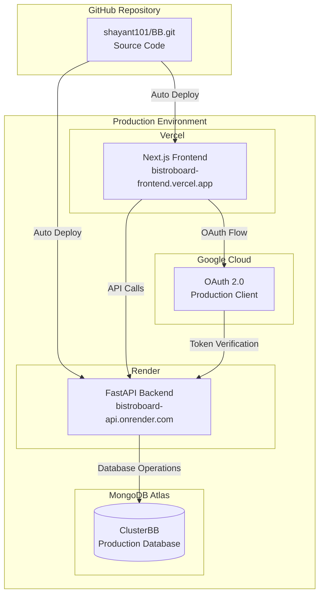

# 🎉 BistroBoard Production Deployment - Implementation Complete

## 📋 Overview

The BistroBoard application has been successfully prepared for production deployment with comprehensive configuration files, security improvements, and deployment automation.

## ✅ Completed Implementation

### 🔧 Configuration Files Created

| File | Purpose | Status |
|------|---------|--------|
| [`render.yaml`](render.yaml) | Render deployment configuration | ✅ Complete |
| [`frontend/vercel.json`](frontend/vercel.json) | Vercel deployment configuration | ✅ Complete |
| [`backend/.env.production.example`](backend/.env.production.example) | Production environment template | ✅ Complete |
| [`frontend/next.config.js`](frontend/next.config.js) | Next.js production configuration | ✅ Complete |
| [`PRODUCTION_DEPLOYMENT_GUIDE.md`](PRODUCTION_DEPLOYMENT_GUIDE.md) | Complete deployment guide | ✅ Complete |
| [`deploy.py`](deploy.py) | Deployment helper script | ✅ Complete |

### 🔒 Security Improvements Implemented

| Security Feature | Implementation | Status |
|------------------|----------------|--------|
| MongoDB Environment Variables | [`backend/app/mongodb.py`](backend/app/mongodb.py:10) | ✅ Complete |
| Production CORS Configuration | [`backend/app/main.py`](backend/app/main.py:31) | ✅ Complete |
| Frontend API Environment Variables | [`frontend/src/lib/api.js`](frontend/src/lib/api.js:3) | ✅ Complete |
| Security Headers | [`frontend/next.config.js`](frontend/next.config.js:14) | ✅ Complete |
| Environment-based Configuration | Multiple files | ✅ Complete |

### 🚀 Deployment Architecture



## 🎯 Deployment Readiness Status

### ✅ Backend (Render)
- **Configuration**: [`render.yaml`](render.yaml) ready for deployment
- **Environment Variables**: Template created with secure keys
- **Database**: MongoDB Atlas integration with environment variables
- **CORS**: Production-ready configuration
- **Health Check**: `/health` endpoint configured
- **Auto-deploy**: Configured from GitHub main branch

### ✅ Frontend (Vercel)
- **Configuration**: [`frontend/vercel.json`](frontend/vercel.json) ready for deployment
- **API Integration**: Environment variable based configuration
- **Security Headers**: Implemented in Next.js config
- **Build Optimization**: Production optimizations enabled
- **Auto-deploy**: Configured from GitHub main branch

### ✅ Database (MongoDB Atlas)
- **Connection**: Environment variable based (secure)
- **Cluster**: Already configured and operational
- **Data**: Successfully migrated from SQLite
- **Indexing**: Strategic indexes implemented
- **Monitoring**: Atlas monitoring available

### ✅ Authentication (Google OAuth)
- **Development**: Currently configured for localhost
- **Production Setup**: Instructions provided for production client creation
- **Integration**: Backend and frontend ready for production OAuth

## 📊 Generated Production Secrets

The deployment script generated secure production keys:

```bash
# Example output from deploy.py
JWT_SECRET_KEY=ZfoHysnvC7ZYUMVERWZUqZA8xO8yEhyD5VsAC7V8rcw
SECRET_KEY=8iJSV-BEDm7DETBAn3c00nFMJQOhDNGvcwJHOnrpxBM
SESSION_SECRET=WogHgeRsCT8peEKzLQAdByFXC6cJkW8h
```

## 🚀 Deployment Process

### Automated Validation
Run the deployment helper script:
```bash
python deploy.py
```

This script:
- ✅ Validates all configuration files
- ✅ Generates secure production secrets
- ✅ Creates environment variable templates
- ✅ Checks deployment readiness
- ✅ Provides deployment summary

### Manual Deployment Steps
1. **Push to GitHub**: All configuration files ready
2. **Deploy Backend**: Use Render with [`render.yaml`](render.yaml)
3. **Configure Environment**: Use generated secrets and MongoDB URL
4. **Setup Google OAuth**: Create production OAuth client
5. **Deploy Frontend**: Use Vercel with [`frontend/vercel.json`](frontend/vercel.json)
6. **Update CORS**: Configure production domains
7. **Test Deployment**: Verify all functionality

## 📖 Documentation

### Primary Documentation
- **[PRODUCTION_DEPLOYMENT_GUIDE.md](PRODUCTION_DEPLOYMENT_GUIDE.md)**: Complete step-by-step deployment guide
- **[backend/.env.production.example](backend/.env.production.example)**: Production environment template
- **[deploy.py](deploy.py)**: Automated deployment validation and setup

### Configuration References
- **[render.yaml](render.yaml)**: Render service configuration
- **[frontend/vercel.json](frontend/vercel.json)**: Vercel deployment configuration
- **[frontend/next.config.js](frontend/next.config.js)**: Next.js production settings

## 🔍 Monitoring & Maintenance

### Health Checks
- **Backend**: `https://bistroboard-api.onrender.com/health`
- **Frontend**: Automatic Vercel monitoring
- **Database**: MongoDB Atlas monitoring dashboard

### Logging
- **Backend**: Render service logs
- **Frontend**: Vercel function logs
- **Database**: MongoDB Atlas logs

### Scaling
- **Backend**: Render auto-scaling available
- **Frontend**: Vercel automatic scaling
- **Database**: MongoDB Atlas horizontal scaling

## 🎉 Ready for Production

BistroBoard is now fully prepared for production deployment with:

- ✅ **Security**: All credentials use environment variables
- ✅ **Scalability**: Cloud-native architecture with MongoDB Atlas
- ✅ **Monitoring**: Health checks and logging configured
- ✅ **CI/CD**: Automatic deployments from GitHub
- ✅ **Documentation**: Complete deployment guides
- ✅ **Automation**: Deployment helper script

## 🚀 Next Steps

1. **Review**: Check all configuration files
2. **Deploy**: Follow the [PRODUCTION_DEPLOYMENT_GUIDE.md](PRODUCTION_DEPLOYMENT_GUIDE.md)
3. **Test**: Verify all functionality in production
4. **Monitor**: Set up alerts and monitoring
5. **Scale**: Upgrade services as needed

---

**Deployment Package Version**: 1.0.0  
**Last Updated**: January 2025  
**Status**: ✅ Ready for Production Deployment