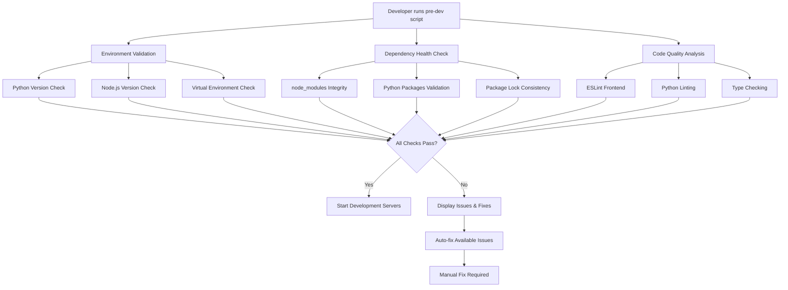

# Development Workflow Improvement Plan

## Executive Summary

This document outlines a comprehensive plan to address recurring development environment inconsistencies and code quality gaps in the BistroBoard project. The solution centers around implementing a robust pre-development health check system that validates environments, dependencies, and code quality before starting development servers.

## Problem Analysis

### Root Causes Identified

1. **Environment Version Mismatches**
   - Python version inconsistencies between local environment and project requirements
   - Node.js version compatibility issues
   - Missing or outdated development tools

2. **Dependency Management Issues**
   - Corrupted `node_modules` directories
   - Unstable frontend dependencies
   - Missing Python virtual environment setup
   - Outdated package versions causing conflicts

3. **Code Quality Gaps**
   - Simple bugs like `AttributeError` in Python code
   - Missing React keys in frontend components
   - Inconsistent code formatting
   - Lack of automated quality checks

### Current State Assessment

**Strengths:**
- Existing validation script in [`frontend/scripts/validate-setup.js`](frontend/scripts/validate-setup.js)
- ESLint configuration via Next.js
- Clear project structure with defined requirements
- Python version pinned in [`.python-version`](.python-version) (3.11.13)
- Node.js requirements defined in [`package.json`](frontend/package.json)

**Gaps:**
- No Python linting configuration
- Limited backend environment validation
- No automated dependency health checks
- Missing pre-commit hooks
- No integration between frontend and backend validation

## Proposed Solution: Enhanced Pre-Dev Health Check System

### Architecture Overview



### Component 1: Environment Validation

#### Python Environment Checks
- **Version Validation**: Compare installed Python version against [`.python-version`](.python-version)
- **Virtual Environment**: Verify `venv` exists and is activated
- **Required Tools**: Check for `pip`, `uvicorn`, and other essential tools

#### Node.js Environment Checks  
- **Version Validation**: Compare installed Node.js version against [`package.json`](frontend/package.json) engines field
- **Package Manager**: Verify npm version compatibility
- **Global Dependencies**: Check for required global packages

#### Implementation Example:
```bash
#!/bin/bash
# check-environment.sh

# Python version check
REQUIRED_PYTHON=$(cat .python-version)
CURRENT_PYTHON=$(python --version 2>&1 | cut -d' ' -f2)

if [ "$CURRENT_PYTHON" != "$REQUIRED_PYTHON" ]; then
    echo "❌ Python version mismatch: Required $REQUIRED_PYTHON, Found $CURRENT_PYTHON"
    exit 1
fi

# Node.js version check
REQUIRED_NODE=$(node -p "require('./frontend/package.json').engines?.node || '>=18'")
CURRENT_NODE=$(node --version)

# Additional checks...
```

### Component 2: Dependency Health Verification

#### Frontend Dependency Checks
- **node_modules Integrity**: Verify no corrupted packages
- **Package Lock Consistency**: Ensure `package-lock.json` matches `package.json`
- **Dependency Vulnerabilities**: Run `npm audit` and report issues
- **Outdated Packages**: Identify packages with available updates

#### Backend Dependency Checks
- **Virtual Environment**: Verify all packages from [`requirements.txt`](backend/requirements.txt) are installed
- **Package Conflicts**: Check for version conflicts
- **Security Vulnerabilities**: Run `pip audit` equivalent checks

#### Implementation Strategy:
```javascript
// Enhanced frontend/scripts/validate-setup.js
async function checkDependencyHealth() {
  // Check node_modules integrity
  const nodeModulesPath = path.join(__dirname, '..', 'node_modules');
  const packageLockPath = path.join(__dirname, '..', 'package-lock.json');
  
  // Verify critical packages exist
  const criticalPackages = ['next', 'react', 'axios'];
  for (const pkg of criticalPackages) {
    if (!fs.existsSync(path.join(nodeModulesPath, pkg))) {
      throw new Error(`Critical package missing: ${pkg}`);
    }
  }
  
  // Check for package-lock consistency
  const { execSync } = require('child_process');
  try {
    execSync('npm ci --dry-run', { stdio: 'pipe' });
  } catch (error) {
    throw new Error('package-lock.json is out of sync with package.json');
  }
}
```

### Component 3: Code Quality Analysis

#### Frontend Linting Setup
- **ESLint Configuration**: Enhance existing Next.js ESLint config
- **Prettier Integration**: Add code formatting checks
- **TypeScript Checks**: Validate TypeScript files if present
- **React-Specific Rules**: Check for missing keys, unused variables

#### Backend Linting Setup
- **Flake8 Configuration**: Add Python linting
- **Black Formatting**: Ensure consistent code formatting
- **MyPy Type Checking**: Add static type checking
- **Import Sorting**: Use isort for consistent imports

#### Configuration Files to Add:

**`.flake8`** (Backend root):
```ini
[flake8]
max-line-length = 88
extend-ignore = E203, W503
exclude = 
    .git,
    __pycache__,
    venv,
    .venv,
    migrations
```

**`pyproject.toml`** (Backend root):
```toml
[tool.black]
line-length = 88
target-version = ['py311']
include = '\.pyi?$'
extend-exclude = '''
/(
  migrations
)/
'''

[tool.isort]
profile = "black"
multi_line_output = 3
line_length = 88
```

**Enhanced `.eslintrc.json`** (Frontend root):
```json
{
  "extends": [
    "next/core-web-vitals",
    "eslint:recommended"
  ],
  "rules": {
    "react/jsx-key": "error",
    "no-unused-vars": "warn",
    "no-console": "warn",
    "prefer-const": "error"
  },
  "env": {
    "browser": true,
    "node": true,
    "es6": true
  }
}
```

### Component 4: Integrated Pre-Dev Script

#### Master Health Check Script
Create a comprehensive script that orchestrates all checks:

**`scripts/pre-dev-check.sh`**:
```bash
#!/bin/bash
set -e

echo "🔍 BistroBoard Pre-Development Health Check"
echo "=========================================="

# Colors for output
RED='\033[0;31m'
GREEN='\033[0;32m'
YELLOW='\033[1;33m'
NC='\033[0m' # No Color

# Track issues
ISSUES=0

# Function to log results
log_success() { echo -e "${GREEN}✅ $1${NC}"; }
log_warning() { echo -e "${YELLOW}⚠️  $1${NC}"; ISSUES=$((ISSUES+1)); }
log_error() { echo -e "${RED}❌ $1${NC}"; ISSUES=$((ISSUES+1)); }

# 1. Environment Validation
echo -e "\n📋 Environment Validation"
echo "-------------------------"

# Python version check
REQUIRED_PYTHON=$(cat .python-version)
if command -v python &> /dev/null; then
    CURRENT_PYTHON=$(python --version 2>&1 | cut -d' ' -f2)
    if [ "$CURRENT_PYTHON" = "$REQUIRED_PYTHON" ]; then
        log_success "Python version: $CURRENT_PYTHON"
    else
        log_error "Python version mismatch: Required $REQUIRED_PYTHON, Found $CURRENT_PYTHON"
    fi
else
    log_error "Python not found in PATH"
fi

# Virtual environment check
if [ -d "backend/venv" ]; then
    log_success "Python virtual environment exists"
    if [[ "$VIRTUAL_ENV" == *"backend/venv"* ]]; then
        log_success "Virtual environment is activated"
    else
        log_warning "Virtual environment not activated. Run: source backend/venv/bin/activate"
    fi
else
    log_error "Python virtual environment not found. Run: cd backend && python -m venv venv"
fi

# Node.js version check
if command -v node &> /dev/null; then
    CURRENT_NODE=$(node --version | sed 's/v//')
    REQUIRED_NODE_MAJOR=$(node -p "require('./frontend/package.json').engines?.node?.match(/\d+/)?.[0] || '18'")
    CURRENT_NODE_MAJOR=$(echo $CURRENT_NODE | cut -d. -f1)
    
    if [ "$CURRENT_NODE_MAJOR" -ge "$REQUIRED_NODE_MAJOR" ]; then
        log_success "Node.js version: v$CURRENT_NODE"
    else
        log_error "Node.js version too old: Required >=$REQUIRED_NODE_MAJOR, Found $CURRENT_NODE_MAJOR"
    fi
else
    log_error "Node.js not found in PATH"
fi

# 2. Dependency Health Check
echo -e "\n📦 Dependency Health Check"
echo "--------------------------"

# Backend dependencies
if [ -f "backend/requirements.txt" ] && [ -d "backend/venv" ]; then
    cd backend
    if source venv/bin/activate 2>/dev/null; then
        if pip check &> /dev/null; then
            log_success "Python dependencies are consistent"
        else
            log_warning "Python dependency conflicts detected"
        fi
        
        # Check if all requirements are installed
        if pip freeze -r requirements.txt &> /dev/null; then
            log_success "All Python requirements are installed"
        else
            log_error "Missing Python requirements. Run: pip install -r requirements.txt"
        fi
    fi
    cd ..
fi

# Frontend dependencies
if [ -d "frontend/node_modules" ]; then
    log_success "Frontend node_modules exists"
    
    cd frontend
    # Check package-lock consistency
    if npm ci --dry-run &> /dev/null; then
        log_success "package-lock.json is consistent"
    else
        log_warning "package-lock.json out of sync. Consider running: npm ci"
    fi
    
    # Check for vulnerabilities
    AUDIT_OUTPUT=$(npm audit --audit-level=high 2>&1 || true)
    if echo "$AUDIT_OUTPUT" | grep -q "found 0 vulnerabilities"; then
        log_success "No high-severity vulnerabilities found"
    else
        log_warning "Security vulnerabilities detected. Run: npm audit fix"
    fi
    cd ..
else
    log_error "Frontend node_modules not found. Run: cd frontend && npm install"
fi

# 3. Code Quality Analysis
echo -e "\n🔍 Code Quality Analysis"
echo "------------------------"

# Frontend linting
cd frontend
if npm run lint &> /dev/null; then
    log_success "Frontend code passes ESLint checks"
else
    log_warning "Frontend linting issues found. Run: npm run lint --fix"
fi
cd ..

# Backend linting (if tools are available)
cd backend
if command -v flake8 &> /dev/null; then
    if flake8 app/ &> /dev/null; then
        log_success "Backend code passes Flake8 checks"
    else
        log_warning "Backend linting issues found. Run: flake8 app/"
    fi
else
    log_warning "Flake8 not installed. Install with: pip install flake8"
fi
cd ..

# 4. Service Health Check
echo -e "\n🏥 Service Health Check"
echo "----------------------"

# Check if ports are available
if lsof -i :8000 &> /dev/null; then
    log_warning "Port 8000 is already in use (Backend)"
else
    log_success "Port 8000 is available (Backend)"
fi

if lsof -i :3000 &> /dev/null; then
    log_warning "Port 3000 is already in use (Frontend)"
else
    log_success "Port 3000 is available (Frontend)"
fi

# Summary
echo -e "\n📊 Health Check Summary"
echo "======================="

if [ $ISSUES -eq 0 ]; then
    log_success "All checks passed! Ready for development."
    echo -e "\n🚀 Start development with:"
    echo "   Backend:  cd backend && source venv/bin/activate && python -m uvicorn app.main:app --reload --port 8000"
    echo "   Frontend: cd frontend && npm run dev"
else
    log_warning "$ISSUES issue(s) found. Please address them before starting development."
    exit 1
fi
```

### Component 5: Workflow Integration

#### Package.json Script Updates
Update [`frontend/package.json`](frontend/package.json) scripts:

```json
{
  "scripts": {
    "dev": "next dev",
    "build": "next build",
    "start": "next start",
    "lint": "next lint",
    "lint:fix": "next lint --fix",
    "validate": "node scripts/validate-setup.js",
    "pre-dev": "../scripts/pre-dev-check.sh",
    "dev:safe": "npm run pre-dev && npm run dev"
  }
}
```

#### Backend Script Integration
Create [`backend/scripts/check-backend.py`](backend/scripts/check-backend.py):

```python
#!/usr/bin/env python3
"""Backend-specific health checks"""

import sys
import subprocess
import pkg_resources
from pathlib import Path

def check_python_version():
    """Check if Python version matches requirements"""
    required_version = Path("../.python-version").read_text().strip()
    current_version = f"{sys.version_info.major}.{sys.version_info.minor}.{sys.version_info.micro}"
    
    if current_version != required_version:
        print(f"❌ Python version mismatch: Required {required_version}, Found {current_version}")
        return False
    
    print(f"✅ Python version: {current_version}")
    return True

def check_dependencies():
    """Check if all dependencies are installed and compatible"""
    try:
        requirements = Path("requirements.txt").read_text().splitlines()
        for req in requirements:
            if req.strip() and not req.startswith("#"):
                pkg_resources.require(req.strip())
        print("✅ All Python dependencies are satisfied")
        return True
    except Exception as e:
        print(f"❌ Dependency issue: {e}")
        return False

def check_linting():
    """Run code quality checks"""
    try:
        result = subprocess.run(["flake8", "app/"], capture_output=True, text=True)
        if result.returncode == 0:
            print("✅ Backend code passes Flake8 checks")
            return True
        else:
            print(f"⚠️ Linting issues found:\n{result.stdout}")
            return False
    except FileNotFoundError:
        print("⚠️ Flake8 not installed. Install with: pip install flake8")
        return False

if __name__ == "__main__":
    checks = [
        check_python_version(),
        check_dependencies(),
        check_linting()
    ]
    
    if all(checks):
        print("\n🎉 Backend health check passed!")
        sys.exit(0)
    else:
        print(f"\n❌ {len([c for c in checks if not c])} check(s) failed")
        sys.exit(1)
```

#### Git Hooks Integration
Create [`.githooks/pre-commit`](.githooks/pre-commit):

```bash
#!/bin/bash
# Pre-commit hook to run health checks

echo "Running pre-commit health checks..."

# Run the pre-dev check
if ! ./scripts/pre-dev-check.sh; then
    echo "❌ Pre-commit checks failed. Please fix issues before committing."
    exit 1
fi

echo "✅ Pre-commit checks passed!"
```

### Component 6: Auto-Fix Capabilities

#### Automated Issue Resolution
The system should attempt to automatically fix common issues:

1. **Dependency Issues**:
   - Run `npm ci` for frontend dependency problems
   - Run `pip install -r requirements.txt` for backend issues

2. **Code Formatting**:
   - Run `npm run lint --fix` for frontend
   - Run `black app/` and `isort app/` for backend

3. **Environment Setup**:
   - Create virtual environment if missing
   - Install missing global dependencies

#### Smart Recommendations
Provide contextual suggestions based on detected issues:

```bash
# Example output
❌ Python version mismatch: Required 3.11.13, Found 3.10.8

💡 Suggested fixes:
   1. Install Python 3.11.13 using pyenv:
      pyenv install 3.11.13
      pyenv local 3.11.13
   
   2. Or update .python-version if 3.10.8 is acceptable:
      echo "3.10.8" > .python-version
```

## Implementation Roadmap

### Phase 1: Foundation (Week 1)
- [ ] Create basic environment validation scripts
- [ ] Set up Python linting configuration (Flake8, Black)
- [ ] Enhance existing frontend validation script
- [ ] Create master pre-dev health check script

### Phase 2: Integration (Week 2)
- [ ] Integrate health checks with package.json scripts
- [ ] Add backend-specific validation script
- [ ] Implement auto-fix capabilities for common issues
- [ ] Create comprehensive documentation

### Phase 3: Advanced Features (Week 3)
- [ ] Add Git hooks integration
- [ ] Implement smart recommendations system
- [ ] Add performance monitoring for health checks
- [ ] Create CI/CD integration guidelines

### Phase 4: Optimization (Week 4)
- [ ] Add caching for faster subsequent runs
- [ ] Implement parallel check execution
- [ ] Add detailed logging and reporting
- [ ] Create developer onboarding guide

## Expected Benefits

### Immediate Impact
- **Reduced Setup Time**: Developers can quickly identify and fix environment issues
- **Fewer Runtime Errors**: Catch configuration problems before they cause failures
- **Consistent Development Environment**: All team members work with validated setups

### Long-term Benefits
- **Improved Code Quality**: Automated linting catches issues early
- **Reduced Debugging Time**: Environment issues are caught before development starts
- **Better Team Productivity**: Less time spent on environment troubleshooting
- **Smoother Onboarding**: New developers can quickly set up their environment

### Metrics for Success
- **Reduction in Environment-Related Issues**: Track tickets related to setup problems
- **Faster Development Startup**: Measure time from git clone to running application
- **Code Quality Improvements**: Monitor linting violations and code review feedback
- **Developer Satisfaction**: Survey team on development experience improvements

## Maintenance and Evolution

### Regular Updates
- **Monthly Dependency Audits**: Review and update dependency checks
- **Quarterly Tool Updates**: Update linting rules and validation logic
- **Continuous Improvement**: Gather developer feedback and iterate

### Monitoring and Alerting
- **Health Check Performance**: Monitor execution time and optimize slow checks
- **Failure Rate Tracking**: Identify common failure patterns and improve auto-fixes
- **Usage Analytics**: Track which checks are most valuable to developers

## Conclusion

This comprehensive Development Workflow Improvement Plan addresses the root causes of environment inconsistencies and code quality gaps through a systematic, automated approach. By implementing robust pre-development health checks, the team can catch issues early, maintain consistent environments, and focus on building features rather than troubleshooting setup problems.

The phased implementation approach ensures gradual adoption while providing immediate value, and the extensible architecture allows for future enhancements based on team needs and feedback.