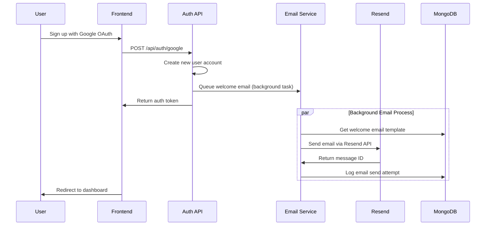
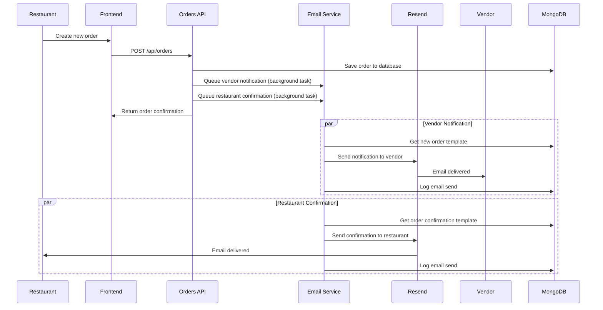
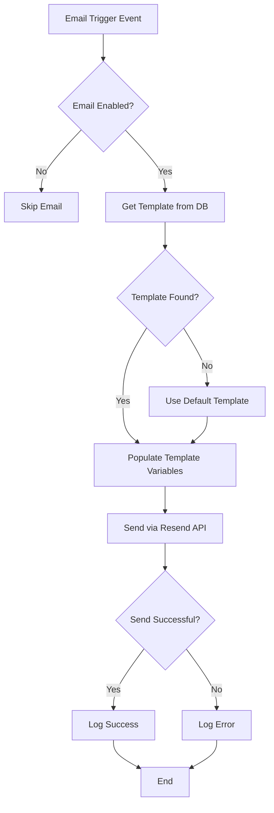

# BistroBoard Email Notification System - Technical Design Document

## Overview

This document outlines the technical architecture for implementing an email notification system in the BistroBoard application. The system will handle three key transactional email events:

1. **Welcome Email** - Sent to new vendors and restaurants upon signup
2. **New Order Notification** - Sent to vendors when they receive a new order
3. **Order Confirmation** - Sent to restaurants when they place an order

## 1. Email Service Provider Recommendation

### Recommended Provider: **Resend**

After evaluating multiple providers with emphasis on cost-effectiveness and developer experience, **Resend** is the recommended choice for BistroBoard.

#### Comparison Analysis

| Provider | Free Tier | Cost per Email | Developer Experience | Integration Complexity |
|----------|-----------|----------------|---------------------|----------------------|
| **Resend** | 3,000/month | $0.0004 after free tier | Excellent (modern API, great docs) | Very Low |
| SendGrid | 100/day (3,000/month) | $0.0006+ | Good | Medium |
| Mailgun | 5,000/month (first 3 months) | $0.0008+ | Good | Medium |
| AWS SES | 62,000/month (if on EC2) | $0.0001 | Fair (complex setup) | High |

#### Why Resend?

1. **Cost-Effective**: 3,000 emails/month free tier, competitive pricing beyond
2. **Developer-First**: Modern REST API, excellent documentation, TypeScript support
3. **Easy Integration**: Simple Python SDK, minimal configuration required
4. **Built for Transactional**: Designed specifically for transactional emails
5. **Good Deliverability**: Strong reputation and deliverability rates
6. **Template Management**: Built-in template system with React components

#### Alternative Recommendation: AWS SES

If already using AWS infrastructure or expecting very high volume (>50k emails/month), AWS SES offers the lowest per-email cost but requires more complex setup.

## 2. Backend API Design

### 2.1 New API Endpoints

#### Email Service Router (`/api/email`)

```python
# app/routers/email.py

from fastapi import APIRouter, Depends, HTTPException, BackgroundTasks
from pydantic import BaseModel, EmailStr
from typing import Optional, Dict, Any
from ..email_service import EmailService
from ..auth_simple import get_current_user

router = APIRouter()

class EmailRequest(BaseModel):
    to_email: EmailStr
    template_type: str  # "welcome", "new_order", "order_confirmation"
    template_data: Dict[str, Any]
    user_id: Optional[int] = None

class EmailResponse(BaseModel):
    success: bool
    message: str
    email_log_id: Optional[str] = None

@router.post("/send", response_model=EmailResponse)
async def send_email(
    email_request: EmailRequest,
    background_tasks: BackgroundTasks,
    current_user = Depends(get_current_user)
):
    """Send transactional email"""
    pass

@router.get("/templates")
async def get_email_templates(current_user = Depends(get_current_user)):
    """Get available email templates"""
    pass

@router.get("/logs/{user_id}")
async def get_email_logs(
    user_id: int,
    current_user = Depends(get_current_user)
):
    """Get email logs for a user (admin only)"""
    pass
```

### 2.2 Email Service Integration

```python
# app/email_service.py

import resend
from typing import Dict, Any, Optional
from .mongo_models import EmailLog, User
from .config import EMAIL_CONFIG

class EmailService:
    def __init__(self):
        resend.api_key = EMAIL_CONFIG["resend_api_key"]
    
    async def send_welcome_email(self, user: User) -> bool:
        """Send welcome email to new user"""
        pass
    
    async def send_new_order_notification(self, order_data: Dict[str, Any]) -> bool:
        """Send new order notification to vendor"""
        pass
    
    async def send_order_confirmation(self, order_data: Dict[str, Any]) -> bool:
        """Send order confirmation to restaurant"""
        pass
    
    async def _send_email(
        self, 
        to_email: str, 
        template_type: str, 
        template_data: Dict[str, Any]
    ) -> bool:
        """Internal method to send email via Resend"""
        pass
    
    async def _log_email(
        self, 
        to_email: str, 
        template_type: str, 
        status: str, 
        external_id: Optional[str] = None
    ):
        """Log email send attempt"""
        pass
```

### 2.3 Integration Points

#### Modified Order Creation Endpoint

```python
# app/routers/orders.py (modified)

@router.post("/orders", response_model=OrderResponse)
async def create_order(
    order_data: OrderCreate, 
    background_tasks: BackgroundTasks,  # Add this
    current_user: User = Depends(get_current_user)
):
    # ... existing order creation logic ...
    
    # Add email notification
    background_tasks.add_task(
        EmailService().send_new_order_notification,
        {
            "order": new_order.dict(),
            "vendor_email": vendor.email,
            "restaurant_name": current_user.name
        }
    )
    
    background_tasks.add_task(
        EmailService().send_order_confirmation,
        {
            "order": new_order.dict(),
            "restaurant_email": current_user.email,
            "vendor_name": vendor.name
        }
    )
    
    return OrderResponse(**new_order.dict())
```

#### Modified User Registration

```python
# app/routers/auth.py (modified)

async def google_login(
    google_request: GoogleLoginRequest,
    background_tasks: BackgroundTasks,  # Add this
    request: Request
):
    # ... existing logic ...
    
    # If new user created, send welcome email
    if user_was_created:  # This flag would be set by find_or_create_user
        background_tasks.add_task(
            EmailService().send_welcome_email,
            user
        )
    
    # ... rest of existing logic ...
```

## 3. Database/Data Model Changes

### 3.1 New MongoDB Collections

#### Email Templates Collection

```python
# app/mongo_models.py (additions)

class EmailTemplate(Document):
    """Email template document"""
    template_id: Indexed(str, unique=True)  # "welcome_vendor", "welcome_restaurant", etc.
    name: str
    subject: str
    html_content: str
    text_content: Optional[str] = None
    variables: List[str] = []  # List of template variables like {{user_name}}
    is_active: bool = True
    created_at: datetime = Field(default_factory=datetime.utcnow)
    updated_at: datetime = Field(default_factory=datetime.utcnow)
    
    class Settings:
        name = "email_templates"
```

#### Email Logs Collection

```python
class EmailLog(Document):
    """Email send log document"""
    log_id: Indexed(str, unique=True)  # UUID
    user_id: Optional[int] = None  # Recipient user ID if applicable
    to_email: EmailStr
    template_type: str  # "welcome", "new_order", "order_confirmation"
    template_id: str  # Specific template used
    subject: str
    status: Indexed(str)  # "sent", "failed", "delivered", "bounced"
    external_id: Optional[str] = None  # Resend message ID
    error_message: Optional[str] = None
    metadata: Dict[str, Any] = {}  # Additional context (order_id, etc.)
    sent_at: Indexed(datetime) = Field(default_factory=datetime.utcnow)
    delivered_at: Optional[datetime] = None
    
    class Settings:
        name = "email_logs"
```

### 3.2 Configuration Changes

#### Environment Variables

```bash
# .env additions
RESEND_API_KEY=re_xxxxxxxxxx
EMAIL_FROM_ADDRESS=noreply@bistroboard.com
EMAIL_FROM_NAME=BistroBoard
EMAIL_ENABLED=true
```

#### Configuration Module

```python
# app/config.py (new file)

import os
from typing import Dict, Any

EMAIL_CONFIG: Dict[str, Any] = {
    "resend_api_key": os.getenv("RESEND_API_KEY"),
    "from_address": os.getenv("EMAIL_FROM_ADDRESS", "noreply@bistroboard.com"),
    "from_name": os.getenv("EMAIL_FROM_NAME", "BistroBoard"),
    "enabled": os.getenv("EMAIL_ENABLED", "true").lower() == "true",
    "templates": {
        "welcome_vendor": "welcome-vendor",
        "welcome_restaurant": "welcome-restaurant", 
        "new_order": "new-order-notification",
        "order_confirmation": "order-confirmation"
    }
}
```

## 4. Workflow Diagrams

### 4.1 Welcome Email Flow



### 4.2 New Order Notification Flow



### 4.3 Email Template Management Flow



## 5. Security Considerations

### 5.1 API Key Management

- **Environment Variables**: Store Resend API key in environment variables, never in code
- **Key Rotation**: Implement process for rotating API keys periodically
- **Access Control**: Limit API key permissions to sending only (not account management)

### 5.2 Email Content Security

- **Template Validation**: Sanitize all user-provided data before inserting into templates
- **XSS Prevention**: Escape HTML content in email templates
- **Content Filtering**: Validate email content to prevent spam/phishing patterns

### 5.3 Rate Limiting

```python
# app/email_service.py (security additions)

from fastapi_limiter import FastAPILimiter
from fastapi_limiter.depends import RateLimiter

@router.post("/send")
@limiter(times=10, seconds=60)  # 10 emails per minute per user
async def send_email(...):
    pass
```

### 5.4 Data Privacy

- **PII Handling**: Minimize personal data stored in email logs
- **Retention Policy**: Implement automatic cleanup of old email logs (90 days)
- **Encryption**: Encrypt sensitive email content in database

### 5.5 Authentication & Authorization

- **JWT Validation**: All email endpoints require valid JWT tokens
- **Role-Based Access**: Only admins can access email logs and templates
- **User Isolation**: Users can only trigger emails for their own accounts

### 5.6 Webhook Security

```python
# For handling Resend webhooks (delivery status updates)
import hmac
import hashlib

def verify_webhook_signature(payload: bytes, signature: str, secret: str) -> bool:
    """Verify webhook signature from Resend"""
    expected_signature = hmac.new(
        secret.encode(),
        payload,
        hashlib.sha256
    ).hexdigest()
    return hmac.compare_digest(signature, expected_signature)
```

## 6. Implementation Dependencies

### 6.1 Python Packages

Add to [`requirements.txt`](bistroboard 2/backend/requirements.txt):

```txt
# Email service
resend==0.6.0
jinja2==3.1.2  # For template rendering
fastapi-limiter==0.1.5  # For rate limiting
```

### 6.2 Database Migrations

```python
# migration_script.py
async def create_email_collections():
    """Create email-related collections and indexes"""
    # Create indexes for EmailLog
    await EmailLog.get_motor_collection().create_index("user_id")
    await EmailLog.get_motor_collection().create_index("status")
    await EmailLog.get_motor_collection().create_index("sent_at")
    
    # Create indexes for EmailTemplate
    await EmailTemplate.get_motor_collection().create_index("template_id")
    await EmailTemplate.get_motor_collection().create_index("is_active")
```

## 7. Testing Strategy

### 7.1 Unit Tests

- Email service methods
- Template rendering
- Error handling scenarios

### 7.2 Integration Tests

- End-to-end email sending
- Webhook processing
- Database logging

### 7.3 Email Testing

- Use Resend's test mode for development
- Implement email preview functionality
- Test with various email clients

## 8. Monitoring & Observability

### 8.1 Metrics to Track

- Email send success/failure rates
- Template usage statistics
- Delivery and bounce rates
- API response times

### 8.2 Logging

```python
import logging

logger = logging.getLogger("bistroboard.email")

async def send_email(...):
    logger.info(f"Sending {template_type} email to {to_email}")
    try:
        # Send email
        logger.info(f"Email sent successfully: {message_id}")
    except Exception as e:
        logger.error(f"Email send failed: {str(e)}")
```

### 8.3 Alerting

- Set up alerts for high failure rates
- Monitor API quota usage
- Track unusual sending patterns

## 9. Deployment Considerations

### 9.1 Environment Setup

1. Create Resend account and obtain API key
2. Configure domain authentication (SPF, DKIM)
3. Set up webhook endpoints for delivery tracking
4. Update environment variables in production

### 9.2 Rollout Strategy

1. **Phase 1**: Deploy email infrastructure without triggering
2. **Phase 2**: Enable welcome emails only
3. **Phase 3**: Enable order-related emails
4. **Phase 4**: Add advanced features (templates, analytics)

### 9.3 Rollback Plan

- Feature flags to disable email sending
- Database rollback scripts
- API key rotation procedures

## 10. Future Enhancements

### 10.1 Advanced Features

- Email template editor in admin panel
- A/B testing for email content
- Scheduled email campaigns
- Email analytics dashboard

### 10.2 Scalability Improvements

- Queue system for high-volume sending (Redis/Celery)
- Email template caching
- Batch sending capabilities

### 10.3 User Experience

- Email preferences management
- Unsubscribe functionality
- Email preview before sending

---

## Summary

This email notification system design provides a robust, scalable, and secure foundation for BistroBoard's transactional email needs. The choice of Resend as the email service provider balances cost-effectiveness with developer experience, while the MongoDB-based architecture aligns with the existing application infrastructure.

The system is designed to be:
- **Cost-effective**: Generous free tier and competitive pricing
- **Developer-friendly**: Simple API integration and comprehensive error handling
- **Secure**: Proper authentication, rate limiting, and data protection
- **Scalable**: Background processing and efficient database design
- **Maintainable**: Clear separation of concerns and comprehensive logging

Implementation should follow the phased rollout approach to ensure stability and allow for iterative improvements based on real-world usage patterns.