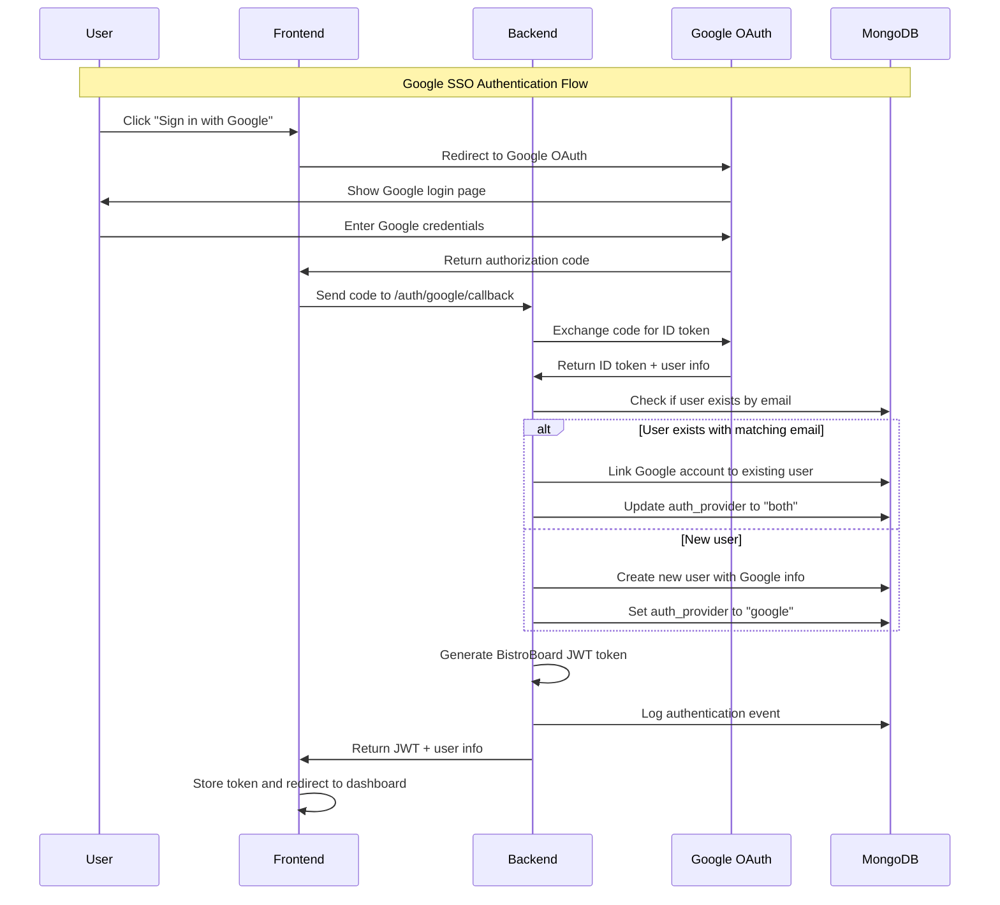
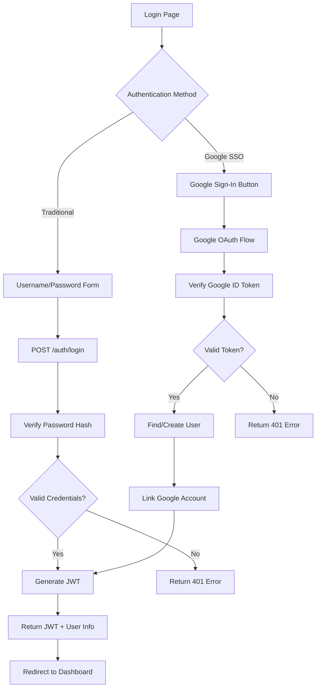
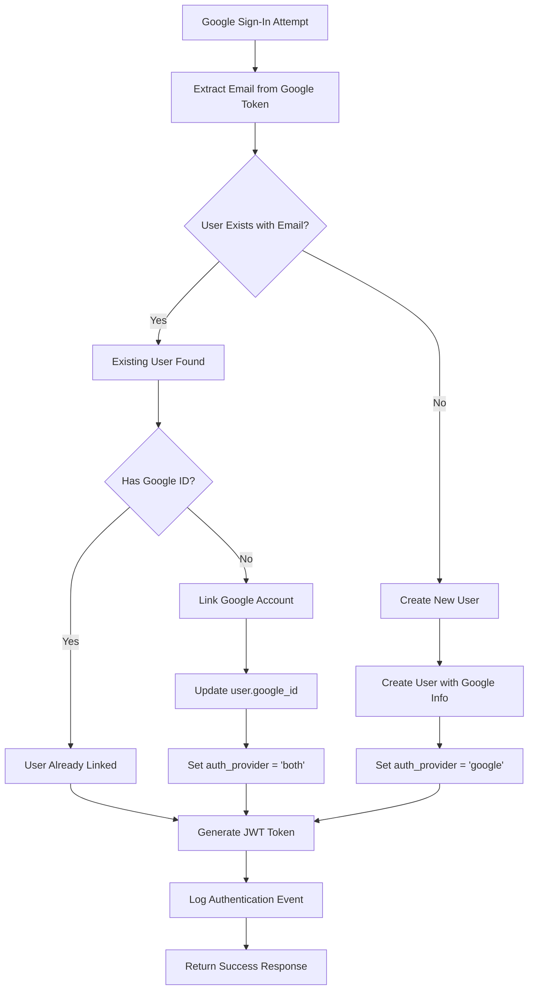

# Google OAuth 2.0 Implementation Guide for BistroBoard

## Table of Contents
1. [Google Cloud Console Setup Guide](#google-cloud-console-setup-guide)
2. [Technical Implementation Plan](#technical-implementation-plan)
3. [Integration Architecture](#integration-architecture)
4. [Security Considerations](#security-considerations)
5. [Testing Strategy](#testing-strategy)

---

## Google Cloud Console Setup Guide

### Step 1: Create or Select Google Cloud Project

1. **Navigate to Google Cloud Console**
   - Go to [https://console.cloud.google.com/](https://console.cloud.google.com/)
   - Sign in with your Google account

2. **Create New Project (or select existing)**
   - Click the project dropdown at the top of the page
   - Click "New Project"
   - Enter project name: `bistroboard-oauth` (or your preferred name)
   - Select your organization (if applicable)
   - Click "Create"
   - Wait for project creation to complete

### Step 2: Enable Required APIs

1. **Navigate to APIs & Services**
   - In the left sidebar, click "APIs & Services" → "Library"

2. **Enable Google+ API**
   - Search for "Google+ API"
   - Click on "Google+ API"
   - Click "Enable"
   - **Note**: While Google+ API is deprecated, it's still required for basic profile information

3. **Enable Google Identity Services**
   - Search for "Google Identity and Access Management (IAM) API"
   - Click "Enable"

4. **Enable People API (Recommended)**
   - Search for "People API"
   - Click "Enable"
   - This provides more comprehensive profile information

### Step 3: Configure OAuth Consent Screen

1. **Navigate to OAuth Consent Screen**
   - Go to "APIs & Services" → "OAuth consent screen"

2. **Choose User Type**
   - Select "External" for public applications
   - Click "Create"

3. **Fill App Information**
   ```
   App name: BistroBoard
   User support email: your-support@email.com
   App logo: (Optional - upload your app logo)
   App domain: your-domain.com (if you have one)
   Authorized domains: 
     - localhost (for development)
     - your-production-domain.com
   Developer contact information: your-dev@email.com
   ```

4. **Scopes Configuration**
   - Click "Add or Remove Scopes"
   - Add these scopes:
     - `../auth/userinfo.email`
     - `../auth/userinfo.profile`
     - `openid`
   - Click "Update"

5. **Test Users (for development)**
   - Add test user emails that can access the app during development
   - Add your own email and any team member emails

6. **Review and Submit**
   - Review all information
   - Click "Back to Dashboard"

### Step 4: Create OAuth 2.0 Credentials

1. **Navigate to Credentials**
   - Go to "APIs & Services" → "Credentials"
   - Click "Create Credentials" → "OAuth client ID"

2. **Configure OAuth Client**
   ```
   Application type: Web application
   Name: BistroBoard Web Client
   
   Authorized JavaScript origins:
     - http://localhost:3000 (for Next.js development)
     - http://localhost:8000 (for FastAPI development)
     - https://your-production-domain.com
   
   Authorized redirect URIs:
     - http://localhost:3000/auth/google/callback
     - http://localhost:8000/auth/google/callback
     - https://your-production-domain.com/auth/google/callback
     - https://api.your-production-domain.com/auth/google/callback
   ```

3. **Save Credentials**
   - Click "Create"
   - **IMPORTANT**: Copy and securely store:
     - Client ID
     - Client Secret
   - Download the JSON file for backup

### Step 5: Environment Configuration

Create environment variables for your application:

```bash
# Backend (.env)
GOOGLE_CLIENT_ID=your-client-id-here
GOOGLE_CLIENT_SECRET=your-client-secret-here
GOOGLE_REDIRECT_URI=http://localhost:8000/auth/google/callback

# Frontend (.env.local)
NEXT_PUBLIC_GOOGLE_CLIENT_ID=your-client-id-here
```

---

## Technical Implementation Plan

### Current System Analysis

**Existing Authentication Flow:**
1. User submits username/password via [`/auth/login`](backend/app/routers/auth.py:15)
2. Password verified using SHA256 hash in [`verify_password()`](backend/app/auth_simple.py:45)
3. JWT-like token created with [`create_access_token()`](backend/app/auth_simple.py:53)
4. User data stored in [`User`](backend/app/mongo_models.py:28) MongoDB document
5. Event logging via [`log_user_event()`](backend/app/admin_auth.py)

**Integration Points:**
- Extend [`User`](backend/app/mongo_models.py:28) model for Google authentication
- Add new OAuth endpoints to [`auth.py`](backend/app/routers/auth.py)
- Maintain existing JWT token system
- Preserve event logging functionality

### Backend Implementation Strategy (FastAPI)

#### 1. Dependencies and Requirements

Add to [`requirements.txt`](backend/requirements.txt):
```
google-auth==2.23.4
google-auth-oauthlib==1.1.0
google-auth-httplib2==0.1.1
requests==2.31.0
```

#### 2. User Model Updates

Extend [`User`](backend/app/mongo_models.py:28) model:
```python
class User(Document):
    # Existing fields...
    
    # Google OAuth fields
    google_id: Optional[str] = None
    google_email: Optional[str] = None
    google_verified_email: bool = False
    google_picture: Optional[str] = None
    auth_provider: str = "local"  # "local", "google", "both"
    
    # Make password_hash optional for Google-only users
    password_hash: Optional[str] = None
```

#### 3. OAuth Service Implementation

Create `backend/app/google_oauth.py`:
```python
from google.auth.transport import requests
from google.oauth2 import id_token
from google_auth_oauthlib.flow import Flow
import os

class GoogleOAuthService:
    def __init__(self):
        self.client_id = os.getenv("GOOGLE_CLIENT_ID")
        self.client_secret = os.getenv("GOOGLE_CLIENT_SECRET")
        self.redirect_uri = os.getenv("GOOGLE_REDIRECT_URI")
    
    def get_authorization_url(self):
        # Generate OAuth authorization URL
        
    def verify_token(self, token: str):
        # Verify Google ID token
        
    def get_user_info(self, token: str):
        # Extract user information from token
```

#### 4. New Authentication Endpoints

Add to [`auth.py`](backend/app/routers/auth.py):
```python
@router.get("/google/login")
async def google_login():
    # Redirect to Google OAuth

@router.post("/google/callback")
async def google_callback(code: str):
    # Handle Google OAuth callback
    # 1. Exchange code for tokens
    # 2. Verify ID token
    # 3. Extract user info
    # 4. Find or create user
    # 5. Generate BistroBoard JWT
    # 6. Log authentication event

@router.post("/google/verify")
async def google_verify_token(token: str):
    # Verify Google ID token directly (for frontend)
```

### Frontend Implementation Strategy (Next.js)

#### 1. Dependencies

Add to [`package.json`](frontend/package.json):
```json
{
  "dependencies": {
    "google-auth-library": "^9.4.0",
    "@google-cloud/local-auth": "^3.0.1"
  }
}
```

#### 2. Google Sign-In Component

Create `frontend/src/components/GoogleSignIn.js`:
```javascript
import { GoogleAuth } from 'google-auth-library';

export default function GoogleSignIn({ onSuccess, onError }) {
  const handleGoogleSignIn = async () => {
    // Implement Google Sign-In flow
    // 1. Initialize Google Auth
    // 2. Trigger sign-in popup
    // 3. Get ID token
    // 4. Send to backend for verification
    // 5. Handle response
  };

  return (
    <button 
      onClick={handleGoogleSignIn}
      className="google-signin-btn"
    >
      
      Sign in with Google
    </button>
  );
}
```

#### 3. Authentication API Updates

Extend [`api.js`](frontend/src/lib/api.js):
```javascript
export const authAPI = {
  // Existing methods...
  
  googleLogin: async (idToken) => {
    const response = await api.post('/auth/google/verify', { 
      token: idToken 
    });
    return response.data;
  },
  
  linkGoogleAccount: async (idToken) => {
    const response = await api.post('/auth/google/link', { 
      token: idToken 
    });
    return response.data;
  }
};
```

### Database Schema Changes

#### Migration Strategy

1. **Add Google OAuth fields to existing users**
2. **Create index on google_id for performance**
3. **Update unique constraints to handle email conflicts**

Create `backend/google_oauth_migration.py`:
```python
async def migrate_users_for_google_oauth():
    # Add Google OAuth fields to existing users
    # Update indexes
    # Handle any data conflicts
```

---

## Integration Architecture

### Authentication Flow Diagram



### Dual Authentication System



### User Account Linking Strategy



---

## Security Considerations

### 1. Token Security

**Google ID Token Verification:**
- Always verify tokens server-side using Google's verification libraries
- Check token expiration and issuer
- Validate audience matches your client ID
- Never trust client-side token validation alone

**BistroBoard JWT Security:**
- Upgrade from simple base64 encoding to proper JWT with HMAC/RSA signatures
- Implement token refresh mechanism
- Use secure, random secret keys
- Set appropriate token expiration times

### 2. Account Linking Security

**Email Verification:**
- Only link accounts with verified Google emails
- Check `email_verified` field in Google token
- Consider additional email verification for sensitive operations

**Prevent Account Takeover:**
- Implement rate limiting on authentication endpoints
- Log all authentication attempts
- Monitor for suspicious linking patterns
- Require re-authentication for sensitive account changes

### 3. Data Privacy

**User Information Handling:**
- Only request necessary OAuth scopes
- Store minimal required user data
- Implement data retention policies
- Provide user data export/deletion capabilities

**GDPR Compliance:**
- Document data processing purposes
- Implement consent management
- Provide clear privacy policies
- Enable user data portability

### 4. Production Security Checklist

```markdown
- [ ] Use HTTPS for all OAuth redirects
- [ ] Implement CSRF protection
- [ ] Validate all redirect URIs
- [ ] Use secure session management
- [ ] Implement proper error handling (no sensitive data in errors)
- [ ] Set up monitoring and alerting
- [ ] Regular security audits
- [ ] Keep dependencies updated
```

---

## Error Handling and Fallback Mechanisms

### 1. Google OAuth Errors

**Common Error Scenarios:**
- Network connectivity issues
- Invalid/expired tokens
- User cancels OAuth flow
- Rate limiting from Google
- Invalid client configuration

**Fallback Strategy:**
```python
async def handle_google_auth_error(error_type: str, user_email: str = None):
    if error_type == "network_error":
        # Retry with exponential backoff
        # Fall back to traditional login
    elif error_type == "invalid_token":
        # Clear stored tokens
        # Redirect to login page
    elif error_type == "user_cancelled":
        # Show friendly message
        # Offer traditional login option
```

### 2. Account Linking Failures

**Conflict Resolution:**
- Email already exists with different Google account
- Google account already linked to different user
- Database conflicts during linking

**Recovery Mechanisms:**
- Manual admin intervention tools
- User-initiated unlinking process
- Support ticket system integration

### 3. Graceful Degradation

**When Google Services are Down:**
- Detect Google service availability
- Automatically hide Google sign-in option
- Show clear messaging about temporary unavailability
- Ensure traditional login remains functional

---

## Testing Strategy

### 1. Unit Tests

**Backend Tests:**
```python
# test_google_oauth.py
class TestGoogleOAuth:
    def test_token_verification(self):
        # Test valid token verification
        
    def test_invalid_token_handling(self):
        # Test invalid token rejection
        
    def test_user_creation_from_google(self):
        # Test new user creation
        
    def test_account_linking(self):
        # Test linking Google to existing account
```

**Frontend Tests:**
```javascript
// GoogleSignIn.test.js
describe('GoogleSignIn Component', () => {
  test('renders sign-in button', () => {
    // Test component rendering
  });
  
  test('handles successful authentication', () => {
    // Test success flow
  });
  
  test('handles authentication errors', () => {
    // Test error handling
  });
});
```

### 2. Integration Tests

**Authentication Flow Tests:**
- Complete OAuth flow from frontend to backend
- Token exchange and verification
- User creation and linking
- JWT generation and validation

**Database Integration:**
- User model updates
- Account linking scenarios
- Event logging verification

### 3. Manual Testing Checklist

```markdown
**Google OAuth Flow:**
- [ ] New user sign-up with Google
- [ ] Existing user linking Google account
- [ ] Sign-in with linked Google account
- [ ] Error handling for cancelled OAuth
- [ ] Error handling for invalid tokens

**Traditional Authentication:**
- [ ] Username/password login still works
- [ ] Password reset functionality
- [ ] Account management features

**Cross-Browser Testing:**
- [ ] Chrome/Chromium
- [ ] Firefox
- [ ] Safari
- [ ] Edge

**Mobile Testing:**
- [ ] iOS Safari
- [ ] Android Chrome
- [ ] Responsive design
```

### 4. Load Testing

**OAuth Endpoint Performance:**
- Concurrent authentication requests
- Token verification performance
- Database query optimization
- Rate limiting effectiveness

---

## Implementation Timeline

### Phase 1: Backend Foundation (Week 1)
- [ ] Set up Google Cloud Console
- [ ] Install required dependencies
- [ ] Create Google OAuth service
- [ ] Implement token verification
- [ ] Add OAuth endpoints

### Phase 2: Database Updates (Week 1)
- [ ] Update User model
- [ ] Create migration script
- [ ] Add database indexes
- [ ] Test account linking logic

### Phase 3: Frontend Integration (Week 2)
- [ ] Install Google Auth libraries
- [ ] Create Google Sign-In component
- [ ] Update authentication API
- [ ] Integrate with existing login flow

### Phase 4: Testing & Security (Week 2)
- [ ] Write comprehensive tests
- [ ] Security audit and fixes
- [ ] Error handling implementation
- [ ] Performance optimization

### Phase 5: Production Deployment (Week 3)
- [ ] Production environment setup
- [ ] SSL certificate configuration
- [ ] Monitoring and logging
- [ ] User acceptance testing

---

## Conclusion

This comprehensive implementation plan provides a secure, scalable approach to integrating Google OAuth 2.0 with BistroBoard while maintaining backward compatibility with existing authentication. The dual authentication system allows users to choose their preferred login method while providing seamless account linking for existing users.

Key benefits of this implementation:
- **User Experience**: Quick sign-up with Gmail accounts
- **Security**: Industry-standard OAuth 2.0 implementation
- **Flexibility**: Support for both traditional and Google authentication
- **Scalability**: Prepared for future OAuth providers
- **Maintainability**: Clean separation of concerns and comprehensive testing

The implementation maintains full compatibility with your existing FastAPI backend, Next.js frontend, and MongoDB Atlas database while adding modern authentication capabilities that users expect.