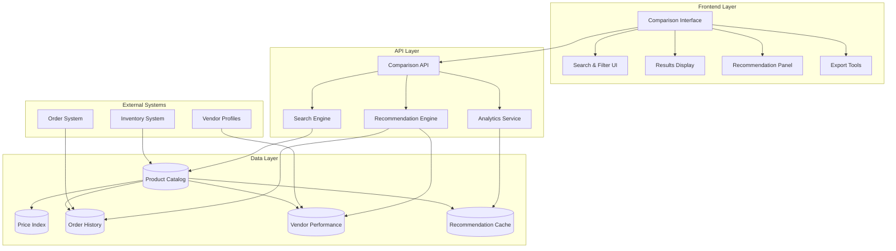
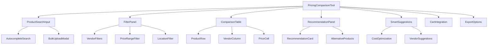
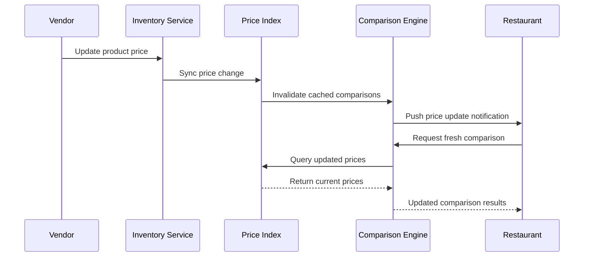
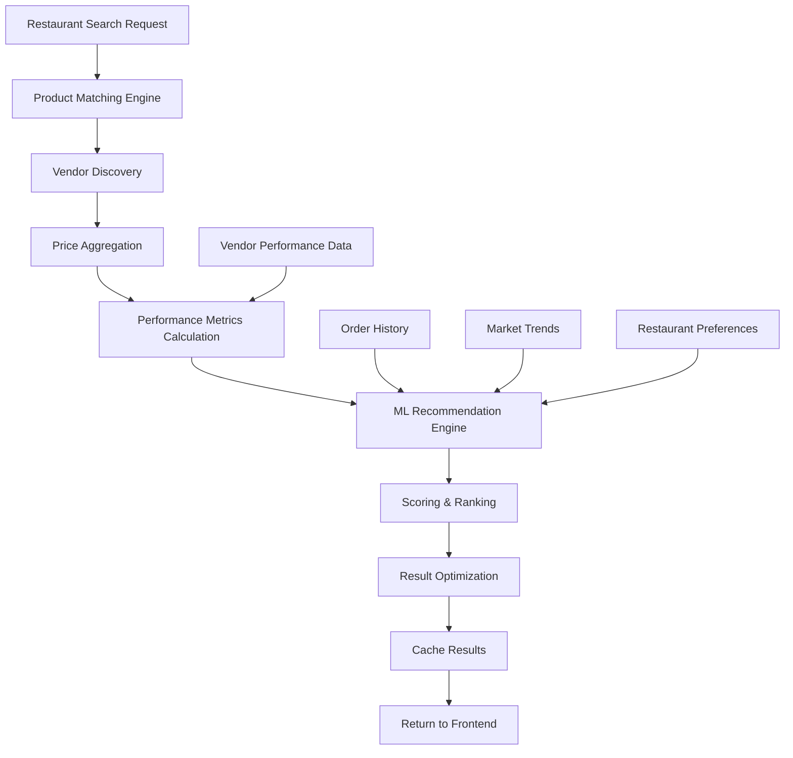

# Restaurant Pricing Comparison Tool - Architecture Design

## 1. Executive Summary

The Restaurant Pricing Comparison Tool is designed as an intelligent procurement assistant that helps restaurants make data-driven purchasing decisions. This tool will serve as the restaurant's "best friend" by providing comprehensive price comparisons, vendor recommendations based on order history, and intelligent suggestions for better alternatives.

### Key Features
- **Multi-Product Comparison**: Compare prices for multiple products across all vendors simultaneously
- **Intelligent Recommendations**: AI-powered vendor suggestions based on order history and performance
- **Bulk Comparison**: Handle large lists of products for comprehensive procurement planning
- **Smart Filtering**: Advanced filtering by vendor ratings, location, delivery terms, and more
- **Export Capabilities**: Generate procurement reports and comparison sheets
- **Direct Cart Integration**: Add items from multiple vendors directly to shopping carts

## 2. System Architecture Overview



## 3. Database Schema Design

### 3.1 New Tables for Pricing Comparison

```sql
-- Product matching and normalization
CREATE TABLE product_catalog_index (
    id INTEGER PRIMARY KEY AUTOINCREMENT,
    normalized_name VARCHAR(255) NOT NULL,
    category_id INTEGER,
    brand VARCHAR(100),
    unit_of_measure VARCHAR(50),
    specifications JSON,
    tags JSON,
    created_at DATETIME DEFAULT CURRENT_TIMESTAMP,
    updated_at DATETIME DEFAULT CURRENT_TIMESTAMP,
    INDEX idx_normalized_name (normalized_name),
    INDEX idx_category (category_id)
);

-- Product mapping to vendor items
CREATE TABLE product_vendor_mapping (
    id INTEGER PRIMARY KEY AUTOINCREMENT,
    catalog_index_id INTEGER NOT NULL REFERENCES product_catalog_index(id),
    vendor_id INTEGER NOT NULL REFERENCES users(id),
    vendor_product_id INTEGER NOT NULL, -- References inventory_items.item_id
    vendor_sku_id INTEGER, -- References inventory_skus.sku_id
    price DECIMAL(10,2) NOT NULL,
    availability_status VARCHAR(20) DEFAULT 'available',
    minimum_order_quantity INTEGER DEFAULT 1,
    lead_time_days INTEGER DEFAULT 0,
    last_price_update DATETIME DEFAULT CURRENT_TIMESTAMP,
    is_active BOOLEAN DEFAULT TRUE,
    created_at DATETIME DEFAULT CURRENT_TIMESTAMP,
    updated_at DATETIME DEFAULT CURRENT_TIMESTAMP,
    INDEX idx_catalog_vendor (catalog_index_id, vendor_id),
    INDEX idx_vendor_product (vendor_id, vendor_product_id),
    INDEX idx_price (price)
);

-- Restaurant order history analysis
CREATE TABLE restaurant_order_analytics (
    id INTEGER PRIMARY KEY AUTOINCREMENT,
    restaurant_id INTEGER NOT NULL REFERENCES users(id),
    vendor_id INTEGER NOT NULL REFERENCES users(id),
    catalog_index_id INTEGER NOT NULL REFERENCES product_catalog_index(id),
    total_orders INTEGER DEFAULT 0,
    total_quantity INTEGER DEFAULT 0,
    total_value DECIMAL(12,2) DEFAULT 0,
    average_price DECIMAL(10,2),
    last_order_date DATETIME,
    order_frequency_days DECIMAL(5,2), -- Average days between orders
    satisfaction_score DECIMAL(3,2), -- Based on order completion, delivery time, etc.
    created_at DATETIME DEFAULT CURRENT_TIMESTAMP,
    updated_at DATETIME DEFAULT CURRENT_TIMESTAMP,
    UNIQUE KEY unique_restaurant_vendor_product (restaurant_id, vendor_id, catalog_index_id),
    INDEX idx_restaurant_product (restaurant_id, catalog_index_id),
    INDEX idx_vendor_performance (vendor_id, satisfaction_score)
);

-- Vendor performance metrics
CREATE TABLE vendor_performance_metrics (
    id INTEGER PRIMARY KEY AUTOINCREMENT,
    vendor_id INTEGER NOT NULL REFERENCES users(id),
    restaurant_id INTEGER NOT NULL REFERENCES users(id),
    metric_type VARCHAR(50) NOT NULL, -- 'delivery_time', 'order_accuracy', 'price_stability', 'availability'
    metric_value DECIMAL(10,4) NOT NULL,
    measurement_period VARCHAR(20) NOT NULL, -- '30_days', '90_days', '1_year'
    calculated_at DATETIME DEFAULT CURRENT_TIMESTAMP,
    INDEX idx_vendor_metric (vendor_id, metric_type),
    INDEX idx_restaurant_vendor (restaurant_id, vendor_id)
);

-- Recommendation cache for performance
CREATE TABLE recommendation_cache (
    id INTEGER PRIMARY KEY AUTOINCREMENT,
    restaurant_id INTEGER NOT NULL REFERENCES users(id),
    cache_key VARCHAR(255) NOT NULL, -- Hash of search parameters
    recommendations JSON NOT NULL,
    expires_at DATETIME NOT NULL,
    created_at DATETIME DEFAULT CURRENT_TIMESTAMP,
    INDEX idx_restaurant_cache (restaurant_id, cache_key),
    INDEX idx_expiry (expires_at)
);

-- Price comparison sessions for analytics
CREATE TABLE price_comparison_sessions (
    id INTEGER PRIMARY KEY AUTOINCREMENT,
    restaurant_id INTEGER NOT NULL REFERENCES users(id),
    session_token VARCHAR(255) NOT NULL,
    search_query JSON, -- Products searched, filters applied
    results_count INTEGER,
    actions_taken JSON, -- Items added to cart, vendors contacted, etc.
    session_duration INTEGER, -- Seconds
    created_at DATETIME DEFAULT CURRENT_TIMESTAMP,
    INDEX idx_restaurant_session (restaurant_id, session_token)
);
```

### 3.2 MongoDB Collections for Advanced Analytics

```javascript
// Product similarity and clustering
db.product_similarity_matrix = {
    _id: ObjectId,
    product_a_id: Number,
    product_b_id: Number,
    similarity_score: Number, // 0-1 scale
    similarity_factors: {
        name_similarity: Number,
        category_match: Boolean,
        specification_overlap: Number,
        usage_pattern_similarity: Number
    },
    updated_at: Date
}

// Restaurant procurement patterns
db.restaurant_procurement_patterns = {
    _id: ObjectId,
    restaurant_id: Number,
    pattern_type: String, // 'seasonal', 'weekly', 'monthly', 'event_based'
    products: [
        {
            catalog_index_id: Number,
            frequency: Number,
            typical_quantity: Number,
            seasonal_variance: Number,
            price_sensitivity: Number
        }
    ],
    confidence_score: Number,
    last_updated: Date
}

// Vendor recommendation models
db.vendor_recommendation_models = {
    _id: ObjectId,
    restaurant_id: Number,
    model_version: String,
    features: {
        price_weight: Number,
        quality_weight: Number,
        delivery_weight: Number,
        relationship_weight: Number,
        availability_weight: Number
    },
    performance_metrics: {
        accuracy: Number,
        precision: Number,
        recall: Number
    },
    created_at: Date,
    is_active: Boolean
}
```

## 4. Backend API Design

### 4.1 Core Comparison Endpoints

```python
# /api/marketplace/compare-prices
@router.post("/compare-prices")
async def compare_prices(
    request: PriceComparisonRequest,
    current_user: User = Depends(get_current_user)
):
    """
    Compare prices for multiple products across vendors
    
    Request Body:
    {
        "products": [
            {
                "search_term": "organic tomatoes",
                "category": "produce",
                "specifications": {"organic": true},
                "quantity": 10
            }
        ],
        "filters": {
            "max_delivery_distance": 50,
            "min_vendor_rating": 4.0,
            "preferred_vendors": [123, 456],
            "exclude_vendors": [789],
            "max_lead_time": 3
        },
        "sort_by": "total_cost", // "unit_price", "vendor_rating", "delivery_time"
        "include_recommendations": true
    }
    
    Response:
    {
        "comparison_id": "comp_12345",
        "products": [
            {
                "search_term": "organic tomatoes",
                "matches": [
                    {
                        "vendor": {...vendor_info},
                        "product": {...product_details},
                        "pricing": {
                            "unit_price": 2.50,
                            "total_cost": 25.00,
                            "bulk_discounts": [...],
                            "minimum_order": 5
                        },
                        "availability": {
                            "status": "in_stock",
                            "lead_time_days": 1,
                            "stock_level": "high"
                        },
                        "performance_metrics": {
                            "delivery_score": 4.8,
                            "quality_score": 4.5,
                            "reliability_score": 4.7
                        }
                    }
                ],
                "recommendations": {
                    "best_value": {...},
                    "fastest_delivery": {...},
                    "highest_quality": {...},
                    "most_reliable": {...}
                }
            }
        ],
        "summary": {
            "total_vendors": 15,
            "total_products_found": 8,
            "estimated_total_cost": 450.00,
            "average_delivery_time": 2.3
        },
        "smart_suggestions": [
            {
                "type": "alternative_product",
                "message": "Consider 'Roma tomatoes' - 20% cheaper with similar quality",
                "product": {...}
            },
            {
                "type": "vendor_recommendation",
                "message": "FreshFarms offers better bulk pricing for your order size",
                "vendor": {...}
            }
        ]
    }
    """

@router.get("/compare-prices/{comparison_id}")
async def get_comparison_results(comparison_id: str):
    """Retrieve cached comparison results"""

@router.post("/compare-prices/{comparison_id}/export")
async def export_comparison(
    comparison_id: str,
    format: str = "csv"  # "csv", "xlsx", "pdf"
):
    """Export comparison results in various formats"""
```

### 4.2 Recommendation Engine Endpoints

```python
@router.get("/recommendations/vendors")
async def get_vendor_recommendations(
    product_ids: List[int],
    current_user: User = Depends(get_current_user)
):
    """
    Get personalized vendor recommendations based on order history
    
    Response:
    {
        "recommendations": [
            {
                "vendor": {...},
                "recommendation_score": 0.85,
                "reasons": [
                    "Consistently delivers on time",
                    "20% better pricing than your current supplier",
                    "High satisfaction from similar restaurants"
                ],
                "risk_factors": [
                    "New vendor - limited history",
                    "Slightly longer delivery times"
                ],
                "estimated_savings": {
                    "monthly": 150.00,
                    "annual": 1800.00
                }
            }
        ],
        "current_suppliers": [...],
        "market_insights": {
            "average_market_price": 2.75,
            "price_trend": "stable",
            "seasonal_factors": "Peak season - prices 15% higher"
        }
    }
    """

@router.get("/recommendations/products")
async def get_product_recommendations(
    search_term: str,
    current_user: User = Depends(get_current_user)
):
    """Get alternative product suggestions"""

@router.post("/recommendations/feedback")
async def submit_recommendation_feedback(
    recommendation_id: str,
    feedback: RecommendationFeedback
):
    """Submit feedback to improve recommendation algorithms"""
```

### 4.3 Analytics and Insights Endpoints

```python
@router.get("/analytics/procurement-insights")
async def get_procurement_insights(
    current_user: User = Depends(get_current_user),
    period: str = "30_days"
):
    """
    Get procurement analytics and insights
    
    Response:
    {
        "spending_analysis": {
            "total_spent": 5000.00,
            "top_categories": [...],
            "vendor_distribution": {...},
            "cost_trends": [...]
        },
        "efficiency_metrics": {
            "average_order_value": 250.00,
            "order_frequency": 2.5, // per week
            "vendor_consolidation_opportunity": 0.3 // 30% potential savings
        },
        "recommendations": [
            {
                "type": "cost_optimization",
                "potential_savings": 200.00,
                "action": "Consolidate orders with FreshFarms",
                "confidence": 0.8
            }
        ]
    }
    """

@router.get("/analytics/market-trends")
async def get_market_trends(category: str = None):
    """Get market pricing trends and forecasts"""
```

## 5. Frontend UI/UX Design

### 5.1 Main Comparison Interface

```jsx
// PricingComparisonTool.js
const PricingComparisonTool = () => {
    return (
        <div className="pricing-comparison-container">
            {/* Search and Input Section */}
            <div className="search-section">
                <ProductSearchInput />
                <BulkUploadOption />
                <FilterPanel />
            </div>
            
            {/* Results Display */}
            <div className="results-section">
                <ComparisonTable />
                <RecommendationPanel />
                <SmartSuggestions />
            </div>
            
            {/* Action Panel */}
            <div className="action-panel">
                <CartIntegration />
                <ExportOptions />
                <SaveComparison />
            </div>
        </div>
    );
};
```

### 5.2 Component Architecture



### 5.3 Key UI Components

#### Product Search Input
```jsx
const ProductSearchInput = () => {
    return (
        <div className="product-search">
            <div className="search-header">
                <h2>Find & Compare Products</h2>
                <button className="bulk-upload-btn">
                    📄 Upload Product List
                </button>
            </div>
            
            <div className="search-inputs">
                {products.map((product, index) => (
                    <div key={index} className="product-input-row">
                        <AutocompleteInput
                            placeholder="Enter product name..."
                            onSelect={(product) => handleProductSelect(index, product)}
                        />
                        <QuantityInput
                            value={product.quantity}
                            onChange={(qty) => handleQuantityChange(index, qty)}
                        />
                        <CategorySelect
                            value={product.category}
                            onChange={(cat) => handleCategoryChange(index, cat)}
                        />
                        <button onClick={() => removeProduct(index)}>×</button>
                    </div>
                ))}
                <button onClick={addProduct} className="add-product-btn">
                    + Add Another Product
                </button>
            </div>
        </div>
    );
};
```

#### Comparison Table
```jsx
const ComparisonTable = ({ comparisonData }) => {
    return (
        <div className="comparison-table-container">
            <div className="table-controls">
                <SortControls />
                <ViewToggle /> {/* Table vs Card view */}
                <ColumnSelector />
            </div>
            
            <table className="comparison-table">
                <thead>
                    <tr>
                        <th>Product</th>
                        <th>Vendor</th>
                        <th>Unit Price</th>
                        <th>Total Cost</th>
                        <th>Delivery</th>
                        <th>Rating</th>
                        <th>Actions</th>
                    </tr>
                </thead>
                <tbody>
                    {comparisonData.map((row) => (
                        <ComparisonRow key={row.id} data={row} />
                    ))}
                </tbody>
            </table>
            
            <ComparisonSummary data={comparisonData} />
        </div>
    );
};
```

#### Recommendation Panel
```jsx
const RecommendationPanel = ({ recommendations }) => {
    return (
        <div className="recommendation-panel">
            <h3>🎯 Smart Recommendations</h3>
            
            <div className="recommendation-categories">
                <RecommendationCategory
                    title="Best Value"
                    icon="💰"
                    recommendations={recommendations.bestValue}
                />
                <RecommendationCategory
                    title="Alternative Products"
                    icon="🔄"
                    recommendations={recommendations.alternatives}
                />
                <RecommendationCategory
                    title="New Vendors"
                    icon="⭐"
                    recommendations={recommendations.newVendors}
                />
            </div>
            
            <ProcurementInsights insights={recommendations.insights} />
        </div>
    );
};
```

## 6. Recommendation Algorithm Architecture

### 6.1 Multi-Factor Scoring System

```python
class VendorRecommendationEngine:
    def __init__(self):
        self.scoring_weights = {
            'price_competitiveness': 0.25,
            'delivery_performance': 0.20,
            'quality_consistency': 0.20,
            'order_history_affinity': 0.15,
            'vendor_reliability': 0.10,
            'product_availability': 0.10
        }
    
    async def calculate_vendor_score(
        self, 
        vendor_id: int, 
        restaurant_id: int, 
        product_ids: List[int]
    ) -> VendorScore:
        """Calculate comprehensive vendor score"""
        
        # Price competitiveness (0-1 scale)
        price_score = await self._calculate_price_score(vendor_id, product_ids)
        
        # Delivery performance based on history
        delivery_score = await self._calculate_delivery_score(vendor_id, restaurant_id)
        
        # Quality consistency from order feedback
        quality_score = await self._calculate_quality_score(vendor_id, restaurant_id)
        
        # Order history affinity
        history_score = await self._calculate_history_affinity(vendor_id, restaurant_id)
        
        # Vendor reliability metrics
        reliability_score = await self._calculate_reliability_score(vendor_id)
        
        # Product availability score
        availability_score = await self._calculate_availability_score(vendor_id, product_ids)
        
        # Weighted final score
        final_score = (
            price_score * self.scoring_weights['price_competitiveness'] +
            delivery_score * self.scoring_weights['delivery_performance'] +
            quality_score * self.scoring_weights['quality_consistency'] +
            history_score * self.scoring_weights['order_history_affinity'] +
            reliability_score * self.scoring_weights['vendor_reliability'] +
            availability_score * self.scoring_weights['product_availability']
        )
        
        return VendorScore(
            vendor_id=vendor_id,
            final_score=final_score,
            component_scores={
                'price': price_score,
                'delivery': delivery_score,
                'quality': quality_score,
                'history': history_score,
                'reliability': reliability_score,
                'availability': availability_score
            }
        )
```

### 6.2 Machine Learning Integration

```python
class ProcurementMLService:
    def __init__(self):
        self.models = {
            'price_prediction': None,
            'demand_forecasting': None,
            'vendor_clustering': None,
            'product_similarity': None
        }
    
    async def train_recommendation_model(self, restaurant_id: int):
        """Train personalized recommendation model"""
        
        # Gather training data
        order_history = await self._get_order_history(restaurant_id)
        vendor_performance = await self._get_vendor_performance(restaurant_id)
        market_data = await self._get_market_data()
        
        # Feature engineering
        features = self._engineer_features(order_history, vendor_performance, market_data)
        
        # Train model using collaborative filtering + content-based approach
        model = self._train_hybrid_model(features)
        
        # Store model for future predictions
        await self._store_model(restaurant_id, model)
        
        return model
    
    async def predict_vendor_preference(
        self, 
        restaurant_id: int, 
        product_context: Dict
    ) -> List[VendorPrediction]:
        """Predict vendor preferences for given product context"""
        
        model = await self._load_model(restaurant_id)
        if not model:
            model = await self.train_recommendation_model(restaurant_id)
        
        predictions = model.predict(product_context)
        return predictions
```

## 7. Data Flow Architecture

### 7.1 Real-time Price Updates



### 7.2 Recommendation Generation Flow



## 8. Performance and Scalability Considerations

### 8.1 Caching Strategy

```python
class ComparisonCacheManager:
    def __init__(self):
        self.redis_client = redis.Redis()
        self.cache_ttl = {
            'price_data': 300,  # 5 minutes
            'vendor_scores': 1800,  # 30 minutes
            'recommendations': 3600,  # 1 hour
            'market_trends': 7200  # 2 hours
        }
    
    async def get_cached_comparison(self, cache_key: str) -> Optional[Dict]:
        """Retrieve cached comparison results"""
        cached_data = await self.redis_client.get(cache_key)
        if cached_data:
            return json.loads(cached_data)
        return None
    
    async def cache_comparison(self, cache_key: str, data: Dict, ttl: int = None):
        """Cache comparison results with appropriate TTL"""
        ttl = ttl or self.cache_ttl['price_data']
        await self.redis_client.setex(
            cache_key, 
            ttl, 
            json.dumps(data, default=str)
        )
```

### 8.2 Database Optimization

```sql
-- Optimized indexes for fast price comparisons
CREATE INDEX idx_product_vendor_price ON product_vendor_mapping 
    (catalog_index_id, is_active, price);

CREATE INDEX idx_vendor_performance ON vendor_performance_metrics 
    (vendor_id, metric_type, measurement_period);

CREATE INDEX idx_order_analytics_restaurant ON restaurant_order_analytics 
    (restaurant_id, last_order_date DESC);

-- Partitioning for large datasets
CREATE TABLE price_comparison_sessions_2024 PARTITION OF price_comparison_sessions
    FOR VALUES FROM ('2024-01-01') TO ('2025-01-01');
```

### 8.3 API Rate Limiting and Load Balancing

```python
from fastapi_limiter import FastAPILimiter
from fastapi_limiter.depends import RateLimiter

@router.post("/compare-prices")
@limiter(RateLimiter(times=10, seconds=60))  # 10 requests per minute
async def compare_prices(request: PriceComparisonRequest):
    """Rate-limited price comparison endpoint"""
    pass
```

## 9. Integration Points

### 9.1 Existing System Integration

```python
class IntegrationService:
    async def sync_with_inventory_system(self):
        """Sync product data from inventory system"""
        
        # Get all active inventory items
        inventory_items = await InventoryService.get_all_active_items()
        
        # Normalize and index products
        for item in inventory_items:
            normalized_product = await self._normalize_product(item)
            await self._update_product_index(normalized_product)
    
    async def sync_with_order_system(self):
        """Sync order history for analytics"""
        
        # Get recent orders
        recent_orders = await OrderService.get_recent_orders()
        
        # Update analytics tables
        for order in recent_orders:
            await self._update_order_analytics(order)
    
    async def integrate_with_cart_system(self, comparison_results: Dict):
        """Enable adding items to cart from comparison results"""
        
        cart_items = []
        for result in comparison_results['products']:
            for match in result['matches']:
                if match.get('selected'):
                    cart_item = self._convert_to_cart_item(match)
                    cart_items.append(cart_item)
        
        return await CartService.add_multiple_items(cart_items)
```

### 9.2 External API Integration

```python
class ExternalDataService:
    async def fetch_market_prices(self, product_categories: List[str]):
        """Fetch market price data from external sources"""
        
        # Integration with commodity price APIs
        # Integration with supplier catalogs
        # Integration with industry price indexes
        pass
    
    async def validate_vendor_certifications(self, vendor_id: int):
        """Validate vendor certifications with external authorities"""
        pass
```

## 10. Implementation Phases

### Phase 1: Foundation (Weeks 1-3)
- **Database Schema Implementation**
  - Create new tables for product indexing and price mapping
  - Set up MongoDB collections for analytics
  - Implement data migration scripts

- **Basic API Endpoints**
  - Product search and matching
  - Simple price comparison
  - Basic vendor filtering

- **Core Frontend Components**
  - Product search interface
  - Basic comparison table
  - Simple filtering options

### Phase 2: Core Functionality (Weeks 4-6)
- **Advanced Comparison Features**
  - Multi-product comparison
  - Bulk upload functionality
  - Export capabilities

- **Integration Layer**
  - Inventory system synchronization
  - Order history integration
  - Cart system integration

- **Performance Optimization**
  - Caching implementation
  - Database indexing
  - API rate limiting

### Phase 3: Intelligence Layer (Weeks 7-10)
- **Recommendation Engine**
  - Basic scoring algorithm
  - Order history analysis
  - Vendor performance metrics

- **Machine Learning Integration**
  - Model training pipeline
  - Prediction services
  - Feedback collection

- **Advanced UI Features**
  - Smart suggestions panel
  - Procurement insights
  - Interactive visualizations

### Phase 4: Advanced Features (Weeks 11-12)
- **AI-Powered Recommendations**
  - Personalized vendor suggestions
  - Alternative product recommendations
  - Market trend analysis

- **Analytics and Reporting**
  - Procurement analytics dashboard
  - Cost optimization insights
  - Performance tracking

- **Polish and Optimization**
  - User experience refinements
  - Performance tuning
  - Documentation and training

## 11. Success Metrics and KPIs

### 11.1 User Engagement Metrics
- **Comparison Tool Usage**: Number of price comparisons per restaurant per month
- **Session Duration**: Average time spent using the comparison tool
- **Feature Adoption**: Percentage of users utilizing advanced features (bulk upload, recommendations)
- **Return Usage**: Frequency of repeat usage by restaurants

### 11.2 Business Impact Metrics
- **Cost Savings**: Average cost savings achieved through price comparisons
- **Order Conversion**: Percentage of comparisons that result in orders
- **Vendor Discovery**: Number of new vendor relationships formed through recommendations
- **Procurement Efficiency**: Reduction in time spent on procurement activities

### 11.3 Technical Performance Metrics
- **Response Time**: Average API response time for comparison requests
- **Cache Hit Rate**: Percentage of requests served from cache
- **Recommendation Accuracy**: Accuracy of ML-powered recommendations
- **System Uptime**: Availability and reliability metrics

## 12. Risk Assessment and Mitigation

### 12.1 Technical Risks
- **Data Synchronization**: Risk of price data becoming stale
  - *Mitigation*: Real-time sync mechanisms and cache invalidation
- **Performance Degradation**: Risk of slow response times with large datasets
  - *Mitigation*: Aggressive caching, database optimization, and pagination
- **ML Model Accuracy**: Risk of poor recommendation quality
  - *Mitigation*: Continuous model training and feedback loops

### 12.2 Business Risks
- **Vendor Adoption**: Risk of incomplete vendor data
  - *Mitigation*: Incentivize vendor participation and data completeness
- **User Complexity**: Risk of overwhelming users with too many options
  - *Mitigation*: Progressive disclosure and intelligent defaults
- **Competitive Response**: Risk of vendors gaming the system
  - *Mitigation*: Robust validation and anomaly detection

## 13. Future Enhancements

### 13.1 Advanced AI Features
- **Predictive Procurement**: Forecast future needs based on historical patterns
- **Dynamic Pricing**: Real-time price optimization based on market conditions
- **Supply Chain Risk Assessment**: Evaluate vendor reliability and supply chain risks

### 13.2 Integration Expansions
- **ERP Integration**: Connect with restaurant ERP systems
- **Accounting Integration**: Automated invoice processing and cost tracking
- **Logistics Optimization**: Delivery route optimization and consolidation

### 13.3 Market Intelligence
- **Competitive Analysis**: Compare pricing against market benchmarks
- **Trend Forecasting**: Predict market trends and price movements
- **Supplier Network Analysis**: Map and analyze supplier relationships

## 14.